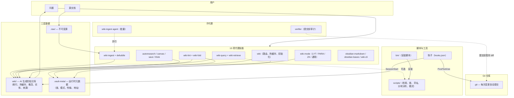

# 系统架构

> claude-obsidian 是一个自组织的 AI 第二大脑，它将 AI 编码代理与 Obsidian 知识库相结合，基于 Andrej Karpathy 的 [[LLM Wiki]] 模式构建。

## 三层数据模型

知识库按照不可变到可变的三个层次组织数据：

```
.raw/               第 1 层：不可变源文档
                     AI 只读，永不修改。通过 .manifest.json 跟踪增量变更。

wiki/               第 2 层：AI 生成的持久知识库
                     索引、热缓存、按领域划分的子目录（概念、实体、
                     来源、比较、问题、折叠、元数据、参考）。

.vault-meta/        第 3 层：运行时元数据
                     传输配置、模式文件、地址计数器、分块阈值、文件锁。
```

## 技能架构（15 项技能）

技能分为 5 个功能领域：

| 领域 | 技能 | 作用 |
|---|---|---|
| **核心** | `wiki` | 初始化、脚手架、热缓存管理、技能路由 |
| **摄取** | `wiki-ingest` | 读取源 → 提取实体/概念 → 写入页面并交叉引用 |
| | `defuddle` | 将网页清理为干净 Markdown（节省 40-60% Token） |
| **查询** | `wiki-query` | 热缓存 → 索引 → 检索 → 综合答案并引用来源 |
| | `wiki-retrieve` | 混合检索（上下文前缀 + BM25 + 余弦重排序）— 可选 |
| **维护** | `wiki-lint` | 健康检查：孤立页面、断裂链接、前置元数据空缺 |
| | `wiki-fold` | 对 log.md 条目进行提取式日志汇总（DragonScale M1） |
| **方法论** | `wiki-mode` | 声明式组织模式（LYT / PARA / Zettelkasten / 通用） |
| **传输** | `wiki-cli` | Obsidian CLI 包装器，用于知识库变更操作 |
| **高级** | `autoresearch` | 自主研究循环：搜索 → 获取 → 综合 → 归档 |
| | `canvas` | 通过 Obsidian Canvas 文件提供可视化层 |
| | `save` | 将对话/洞察作为结构化 wiki 页面归档 |
| | `obsidian-markdown` | Obsidian 风格 Markdown 语法参考 |
| | `obsidian-bases` | Obsidian .base 文件和动态表格 |
| | `think` | 10 项原则的结构化推理循环 |

## 子代理

- **`verifier`** — 对暂存 diff 进行提交前审计（4 级发现：阻断/高/中/低）
- **`wiki-ingest`** — 用于并行批量摄取的专用代理

## 可执行工具

**安装脚本**（`bin/`）：
- `setup-vault.sh` — 初始化知识库
- `setup-multi-agent.sh` — 跨代理安装程序
- `setup-retrieve.sh` — 可选混合检索扩展
- `setup-mode.sh` — 可选方法论模式配置
- `setup-dragonscale.sh` — 可选 DragonScale 内存扩展

**运行时脚本**（`scripts/`）：
- `retrieve.py` / `rerank.py` / `bm25-index.py` — 混合检索管道
- `contextual-prefix.py` — LLM 生成的上下文前缀（用于分块）
- `tiling-check.py` — 语义去重（DragonScale M3）
- `boundary-score.py` — 边界优先的重新摄取评分
- `wiki-mode.py` — 模式感知页面路由
- `wiki-lock.sh` — 每文件的建议性锁，保证多写入者安全
- `allocate-address.sh` — DragonScale 确定性寻址
- `detect-transport.sh` — 传输协商检测

## 生命周期钩子（`hooks/hooks.json`）

三个钩子确保跨会话的上下文持续性：

- **`SessionStart`** — 静默加载 `wiki/hot.md` 到上下文中；清理过期锁
- **`PostCompact`** — 上下文压缩后重新读取热缓存
- **`PostToolUse`** — 每次 wiki 写入后自动暂存并提交（带锁保护）

## 核心设计原则

1. **知识复利** — Wiki 是持久化制品。交叉引用、矛盾标记和综合结果在查询时已预先存在，与 RAG 不同。

2. **不可变源（第 1 层）** — 原始文档存放在 `.raw/` 中，通过清单跟踪增量。AI 永不修改它们。

3. **多传输写入** — 变更通过协商栈路由：Obsidian CLI（首选）→ MCP → 直接文件系统。协商结果缓存在 `.vault-meta/transport.json` 中。

4. **多写入者安全（v1.7+）** — `wiki-lock.sh` 提供每文件的建议性锁，使用 stash-and-apply 模式。`PostToolUse` 钩子处理自动提交。

5. **声明式组织（v1.8+）** — 模式 = LYT / PARA / Zettelkasten / 通用决定了新页面的归档位置。切换模式时现有页面保持不变。

6. **可选升级** — 混合检索、DragonScale 扩展和方法论模式需要明确的安装步骤才能激活。

7. **三层上下文恢复** — `wiki/hot.md`（近期上下文）→ `wiki/index.md`（目录）→ 按需深度读取。由 `wiki-query` 中的快速/标准/深度模式编排。

8. **版本控制的内存** — 每次 wiki 变更后自动提交，确保完整历史可审计、可回滚、跨机器可同步。



## 相关页面

- [[wiki/overview.md]]
- [[wiki/index.md]]
- [[wiki/concepts/System Architecture.md]]
- [[wiki/concepts/DragonScale Memory.md]]
