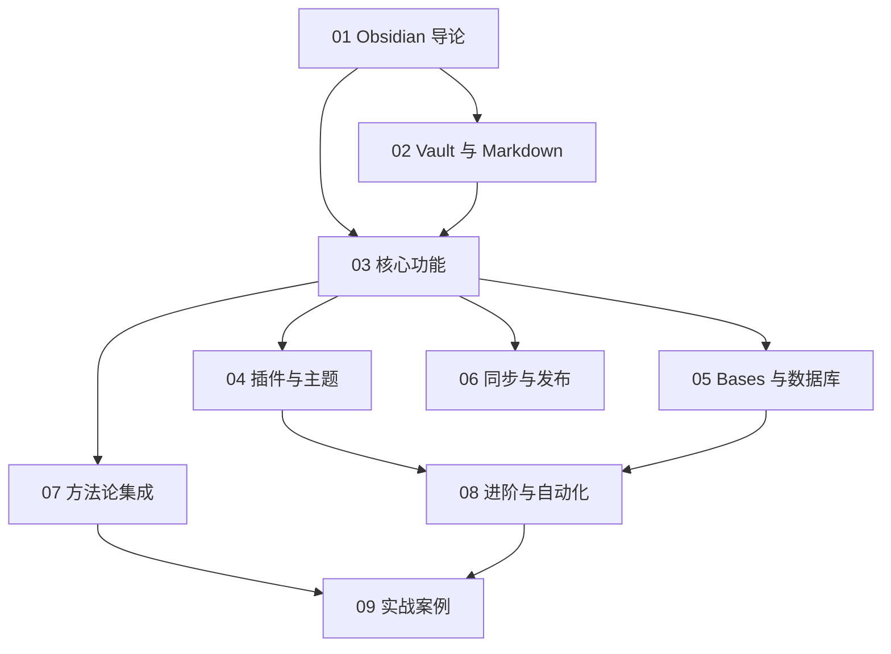

# Obsidian 知识地图

## 分层学习路线

| 层级 | 技能 | 对应章节 |
|:--:|------|:--:|
| L1 | 建 Vault、写 Markdown、用 Wikilink 关联笔记 | 01–02 |
| L2 | 反向链接、图谱、属性、搜索 | 03 |
| L3 | 装插件（Dataview/Templater/Excalidraw）、Bases 数据库 | 04–05 |
| L4 | 同步发布、方法论（PARA/Zettelkasten）、自动化 | 06–08 |
| L5 | 实战：学术、项目、个人知识库 | 09 |

## 两条主线

| 主线 | 内容 |
|------|------|
| **工具线** | Vault → Markdown → 核心功能 → 插件 → Bases → 同步 |
| **方法论线** | 本地优先 → PARA/Zettelkasten/LYT → 实战落地 |

## 关联

[[001-Obsidian]] · [[3 Resources/People/wiki/index|Wiki 索引]] · [[3 Resources/000-Knowledge/raw/articles/001.8-Obsidian-知识库/99-资源收集/资源总览|资源总览]]
