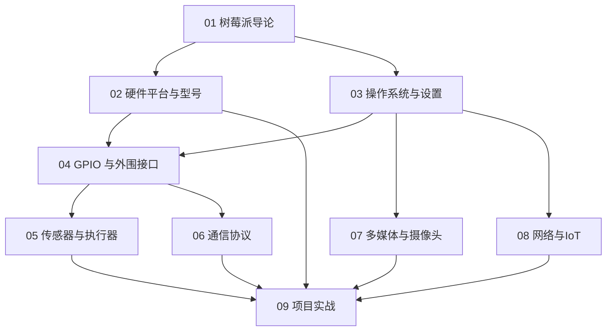

# 树莓派知识地图

## 分层学习路线

| 层级 | 技能 | 对应章节 |
|:--:|------|:--:|
| L1 | 认识 SBC、理解 Pi 生态、选购第一块 Pi | 01–02 |
| L2 | 刷机、SSH 连接、GPIO 点亮 LED、基础传感器读取 | 03–05 |
| L3 | I²C / SPI 通信、Camera 模组、MQTT 联网 | 06–08 |
| L4 | 完整项目整合：气象站、机器人、智能家居中控 | 09 |

## 两大产品线

| 产品线 | 定位 | 运行系统 |
|--------|------|----------|
| Raspberry Pi（SBC） | 通用单板计算机，跑 Linux | Raspberry Pi OS / Ubuntu 等 |
| Raspberry Pi Pico（MCU） | 微控制器开发板，跑裸机 / MicroPython | MicroPython / CircuitPython / C/C++ |

## 关联

[[004-树莓派]] · [[3 Resources/People/wiki/index|Wiki 索引]] · [[3 Resources/000-Knowledge/raw/articles/004.165-RaspberryPi-简体版/99-资源收集/资源总览|资源总览]]
