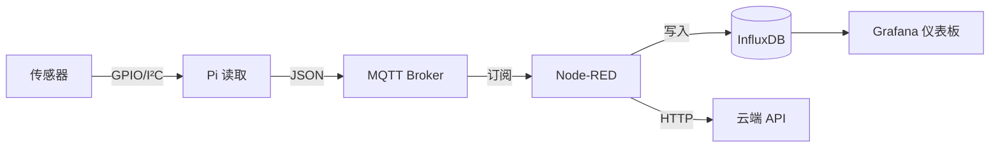

# 08 网络与 IoT

## 网络硬件规格

| 型号 | WiFi | 蓝牙 | 以太网 |
|------|:----:|:----:|:------:|
| **Pi 5** | 802.11ac（WiFi 5） | BT 5.0 / BLE | 千兆 |
| **Pi 4B** | 802.11ac（WiFi 5） | BT 5.0 / BLE | 千兆 |
| **Pi Zero 2 W** | 802.11n（WiFi 4） | BT 4.2 / BLE | — |
| **Pico 2 W** | 802.11n（WiFi 4） | BT 5.2 / BLE | — |

> Pi 4B/5 的以太网为真实千兆（非 USB 桥接），Pi 5 的 WiFi/BT 由 RP1 芯片内置。

## 网络设置

```bash
# 静态 IP（NetworkManager / nmcli — Pi Bookworm 默认）
nmcli con show                          # 查看连接
nmcli con mod "Wired connection 1" \
  ipv4.addresses 192.168.1.100/24 \
  ipv4.gateway 192.168.1.1 \
  ipv4.dns 8.8.8.8 \
  ipv4.method manual

# 或使用 dhcpcd（传统方法）
sudo nano /etc/dhcpcd.conf
# interface wlan0
# static ip_address=192.168.1.100/24
```

## MQTT 消息协议

适合 IoT 场景的轻量级发布/订阅协议。

### Mosquitto Broker 安装与配置

```bash
sudo apt install -y mosquitto mosquitto-clients

# 测试
mosquitto_sub -h localhost -t "sensors/temp" &
mosquitto_pub -h localhost -t "sensors/temp" -m "23.5"
```

### Python MQTT 客户端（paho-mqtt）

```python
import paho.mqtt.client as mqtt
import json
import time

# 发布者 — 传感器数据
client = mqtt.Client()
client.connect("localhost", 1883)
while True:
    data = {"temp": 23.5, "humidity": 65.0, "timestamp": time.time()}
    client.publish("sensors/room1", json.dumps(data))
    time.sleep(5)

# 订阅者 — 接收并处理
def on_message(client, userdata, msg):
    payload = json.loads(msg.payload)
    print(f"[{msg.topic}] {payload}")

client = mqtt.Client()
client.on_message = on_message
client.connect("localhost", 1883)
client.subscribe("sensors/#")
client.loop_forever()
```

### MQTT 主题设计规范

| 模式 | 示例 | 用途 |
|------|------|------|
| `location/device/reading` | `home/living_room/temperature` | 层级化数据组织 |
| `device/command` | `relay1/set` | 控制指令 |
| `device/status` | `relay1/status` | 状态回报 |
| `#`（通配） | `home/#` | 订阅所有子主题 |

> MQTT 默认 port 1883（无加密），8883（TLS）。生产环境务必设置用户认证与 TLS。

## Node-RED — 流程化 IoT 编程

```bash
# 安装
sudo apt install -y nodered
sudo systemctl enable nodered
sudo systemctl start nodered

# 访问 http://<pi-ip>:1880
```

**典型流程示例**：MQTT in → 逻辑判断 → GPIO out / 数据库写入。

```
[MQTT in: sensors/+/temp]
    → [Function: 平均计算]
    → [Dashboard Gauge: 实时温度显示]
    → [MQTT out: alerts/temp_high (if >30°C)]
```

## Home Assistant on Pi

### 安装方式

```bash
# 方法一：直接在 Pi 上安装 HA OS（推荐）
# 使用 Raspberry Pi Imager → Home Assistant OS → 刷入 microSD

# 方法二：Docker（与其他服务共存）
docker run -d \
  --name homeassistant \
  --privileged \
  --restart=unless-stopped \
  -v /opt/ha-config:/config \
  -v /run/dbus:/run/dbus:ro \
  --network=host \
  ghcr.io/home-assistant/home-assistant:stable
```

### Pi 型号选择

| 型号 | 适合 HA 吗？ | 建议 |
|------|:-----------:|------|
| Pi 5（8GB）+ NVMe | ✅ 最佳 | 大型智能家居（>50 设备） |
| Pi 4B（4GB+） | ✅ 很好 | 一般家庭使用 |
| Pi 3B+ | ⚠️ 可用 | 轻量场景 |
| Pi Zero 2 W | ❌ 不推荐 | 性能不足、无以太网 |

## 传感器数据 → 云管线



### 典型技术栈

| 层 | 工具 | 作用 |
|----|------|------|
| 数据采集 | Python + gpiozero | 读取传感器 |
| 消息传递 | Mosquitto MQTT | 解耦发布/订阅 |
| 流程处理 | Node-RED | 逻辑判断/转发 |
| 时序存储 | InfluxDB | 高效时间序列数据库 |
| 可视化 | Grafana | 实时仪表板 |
| 远程访问 | Tailscale / Cloudflare Tunnel | 安全远程连接 |

## 常用 IoT 协议对比

| 协议 | 模式 | QoS | 适合 |
|------|:----:|:---:|------|
| **MQTT** | Pub/Sub | 0/1/2 | 传感器数据、低带宽 |
| **HTTP/REST** | Request/Response | — | Web API、配置管理 |
| **CoAP** | Request/Response | 0/1 | 极低功耗设备 |
| **WebSocket** | 双向长连接 | — | 实时控制、仪表板 |
| **gRPC** | RPC | — | 高效内部服务 |

> 树莓派 IoT 场景：首选 MQTT + InfluxDB + Grafana 组合。

## Pi-hole 广告拦截

- 基于 DNS 的全网广告拦截器，为整个局域网过滤广告/跟踪器。
- 一键安装：`curl -sSL https://install.pi-hole.net | bash`
- 管理后台 `http://<pi-ip>/admin`；把路由器 DNS 指向 Pi 即可全屋生效。

## 关联

[[03-操作系统与设置]] · [[05-传感器与执行器]] · [[09-项目实战]]
