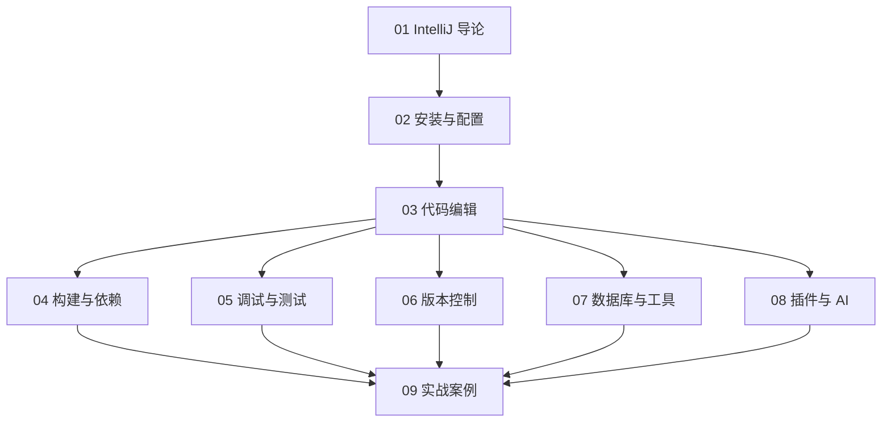

# IntelliJ IDEA 知识地图



## 分层学习路线

| 层级 | 技能 | 对应章节 |
|:--:|------|:--:|
| L1 | 认识 IDEA、安装、项目结构 | 01–02 |
| L2 | 代码编辑、补全、重构 | 03 |
| L3 | 构建、调试、版本控制 | 04–06 |
| L4 | 数据库、插件、AI | 07–08 |
| L5 | 完整项目实战 | 09 |

## 核心开发闭环

```
编码（补全/重构）→ 构建 → 调试 → 测试 → 版本提交
```

## 关联

[[IntelliJ-IDEA]] · [[3 Resources/People/wiki/index|Wiki 索引]] · [[3 Resources/000-Knowledge/raw/articles/004.4-软件/004.41-开发工具/IntelliJ-IDEA/99-资源收集/资源总览|资源总览]]
