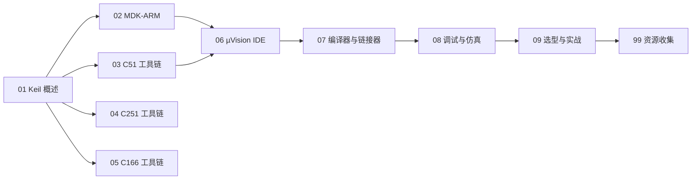

# Keil 知识地图

> Keil 嵌入式工具链的结构化导航——按「产品线 → IDE → 编译 → 调试 → 实战」分层。

## 分层总览

```
Keil 嵌入式开发工具 (004.4)
├── 产品线（按目标内核）
│   ├── MDK-ARM  → ARM Cortex-M / Arm7 / Arm9 / Cortex-R4
│   ├── C51      → 8051 兼容内核（8 位）
│   ├── C251     → 80251 增强内核（8/16 位）
│   └── C166     → Infineon C166 / XC16x（16 位，legacy）
├── IDE 与工程
│   ├── µVision IDE（Windows，legacy）
│   └── Keil Studio（VS Code 扩展，跨平台）
├── 编译与链接
│   ├── Arm Compiler（AC5 armcc / AC6 armclang）
│   └── C51/C251/C166 编译器 + 链接器/定位器
├── 调试与仿真
│   ├── ULINK2 / ULINKpro / ULINKplus
│   ├── CMSIS-DAP（第三方探针）
│   └── 软件仿真器（Simulator）
└── 生态标准
    └── CMSIS（HAL / DSP / RTOS2 / NN）+ Software Packs
```

## 学习路线



## 关联

[[Keil-嵌入式开发工具|主索引]] · [[3 Resources/People/wiki/index|Wiki 索引]] · [[3 Resources/000-Knowledge/raw/articles/004.4-软件/004.41-开发工具/Keil-嵌入式开发工具/99-资源收集/资源总览|资源总览]]
