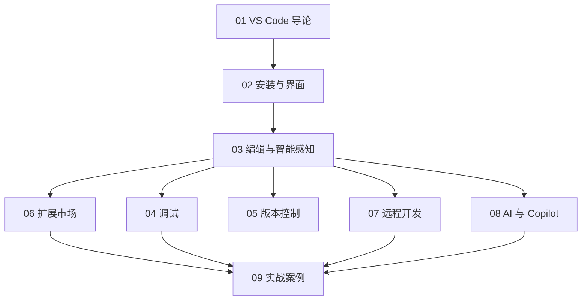

# VS Code 知识地图



## 分层学习路线

| 层级 | 技能 | 对应章节 |
|:--:|------|:--:|
| L1 | 认识 VS Code、界面、命令面板 | 01–02 |
| L2 | 智能感知、扩展 | 03、06 |
| L3 | 调试、版本控制 | 04–05 |
| L4 | 远程开发、AI | 07–08 |
| L5 | 完整项目实战 | 09 |

## 核心开发闭环

```
编辑（IntelliSense）→ 调试 → 版本提交 → 远程/AI 协作
```

## 关联

[[VS-Code]] · [[3 Resources/People/wiki/index|Wiki 索引]] · [[3 Resources/000-Knowledge/raw/articles/004.4-软件/004.41-开发工具/VS-Code/99-资源收集/资源总览|资源总览]]
