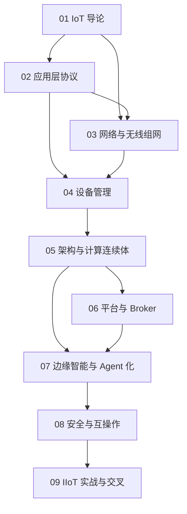

# 物联网知识地图

## 分层学习路线

| 层级 | 技能 | 对应章节 |
|:--:|------|:--:|
| L1 | 理解 IoT 定位与演进 | 01 |
| L2 | 掌握协议与组网 | 02–03 |
| L3 | 设备管理与架构 | 04–05 |
| L4 | 平台、边缘智能、安全 | 06–08 |
| L5 | IIoT 实战与交叉 | 09 |

## 三条主线

| 主线 | 内容 |
|------|------|
| **协议线** | MQTT → CoAP → LwM2M → 国标矩阵 |
| **架构线** | Edge/Cloud/Hybrid → UNS+EDA → 计算连续体 |
| **智能线** | 边缘 AI → MCP over MQTT → A2A → 终端 Agent 化 |

## 关联

[[004.7-物联网]] · [[3 Resources/000-Knowledge/raw/articles/004.7-物联网/wiki/index|Wiki 索引]] · [[3 Resources/000-Knowledge/raw/articles/004.7-物联网/99-资源收集/资源总览|资源总览]]
