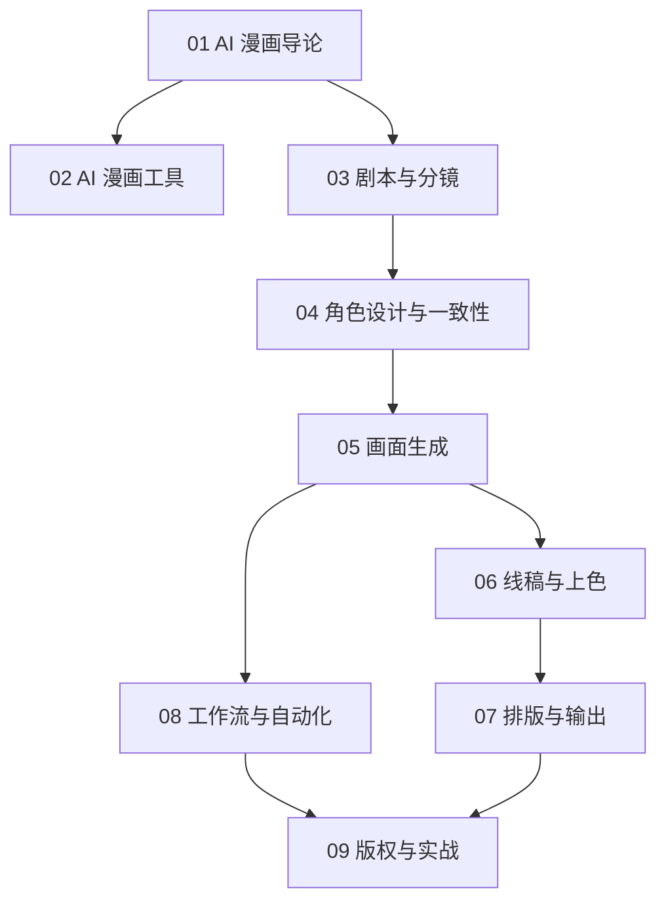

# AI 漫画知识地图

## 分层学习路线

| 层级 | 技能 | 对应章节 |
|:--:|------|:--:|
| L1 | 理解 AI 漫画定位与工具 | 01–02 |
| L2 | 剧本分镜、角色一致性 | 03–04 |
| L3 | 画面生成、线稿上色 | 05–06 |
| L4 | 排版输出、自动化、版权 | 07–09 |

## 三条主线

| 主线 | 内容 |
|------|------|
| **创作线** | 剧本 → 分镜 → 画面 → 上色 → 排版 |
| **一致线** | LoRA → IP-Adapter → ControlNet |
| **工具线** | SD/ComfyUI → NovelAI → Midjourney → 在线平台 |

## 关联

[[004.8-741.5-AI-Comics]] · [[3 Resources/000-Knowledge/raw/articles/004.8-741.5-AI-Comics/wiki/index|Wiki 索引]] · [[3 Resources/000-Knowledge/raw/articles/004.8-741.5-AI-Comics/99-资源收集/资源总览|资源总览]]
