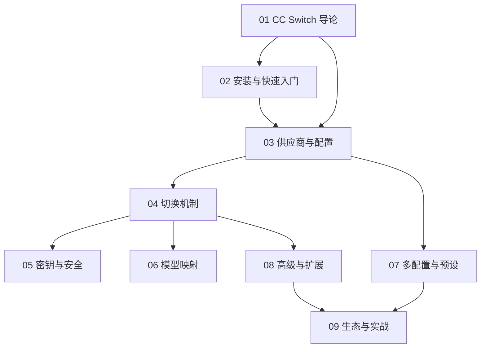

# CC Switch 知识地图

## 分层学习路线

| 层级 | 技能 | 对应章节 |
|:--:|------|:--:|
| L1 | 理解 CC Switch 定位与核心理念 | 01 |
| L2 | 安装、完成首次供应商切换 | 02 |
| L3 | 掌握供应商、配置、切换机制 | 03–04 |
| L4 | 密钥安全、模型映射、多配置 | 05–07 |
| L5 | MCP/提示词扩展、生态实战 | 08–09 |

## 三条主线

| 主线 | 内容 |
|------|------|
| **切换线** | 供应商 → 配置 → 环境变量 → settings.json |
| **安全线** | API 密钥 → 本地存储 → 模型映射 |
| **扩展线** | MCP 管理 → Prompts → Skills → deep link 导入 |

## 关联

[[004.8-CC-Switch]] · [[3 Resources/000-Knowledge/raw/articles/004.8-CC-Switch/wiki/index|Wiki 索引]] · [[3 Resources/000-Knowledge/raw/articles/004.8-CC-Switch/99-资源收集/资源总览|资源总览]]
