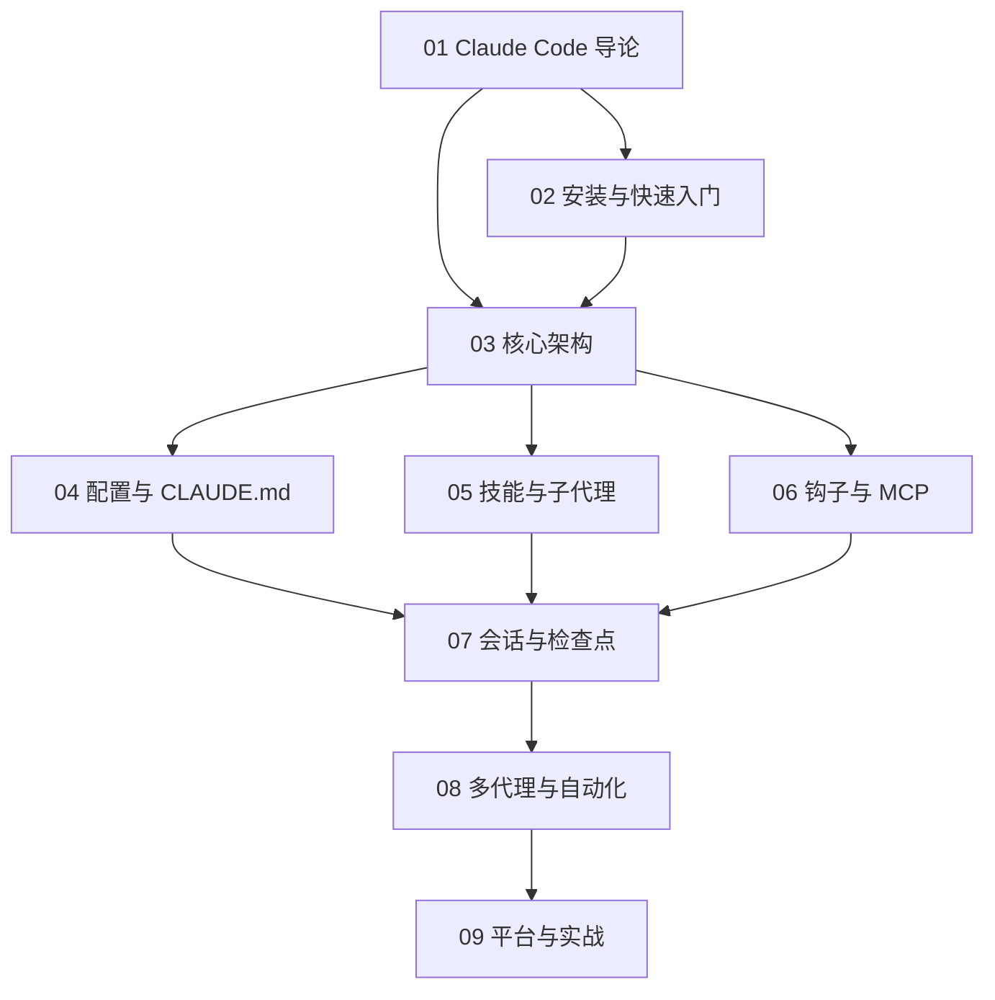

# Claude Code 知识地图

## 分层学习路线

| 层级 | 技能 | 对应章节 |
|:--:|------|:--:|
| L1 | 理解 Claude Code 定位与核心理念 | 01 |
| L2 | 安装、登录、跑通首次对话 | 02 |
| L3 | 掌握核心架构、配置、CLAUDE.md 记忆 | 03–04 |
| L4 | 扩展系统：技能、子代理、钩子、MCP | 05–06 |
| L5 | 会话检查点、多代理自动化、多平台实战 | 07–09 |

## 三条主线

| 主线 | 内容 |
|------|------|
| **核心线** | Agentic 循环 → 内置工具 → 上下文窗口 → 提示缓存 |
| **扩展线** | CLAUDE.md → Skills → Subagents → Hooks → MCP → Plugins |
| **自动化线** | Headless/SDK → Agent 团队 → 动态工作流 → CI/CD |

## 关联

[[004.8-Claude-Code]] · [[3 Resources/000-Knowledge/raw/articles/004.8-Claude-Code/wiki/index|Wiki 索引]] · [[3 Resources/000-Knowledge/raw/articles/004.8-Claude-Code/99-资源收集/资源总览|资源总览]]
