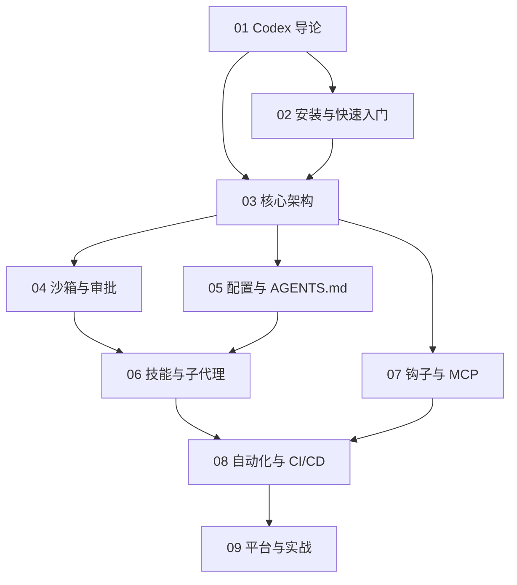

# Codex 知识地图

## 分层学习路线

| 层级 | 技能 | 对应章节 |
|:--:|------|:--:|
| L1 | 理解 Codex 定位与核心理念 | 01 |
| L2 | 安装、登录、跑通首次对话 | 02 |
| L3 | 掌握核心架构、沙箱、审批、配置 | 03–05 |
| L4 | 扩展系统：技能、子代理、钩子、MCP | 06–07 |
| L5 | 自动化 CI/CD、多平台实战 | 08–09 |

## 三条主线

| 主线 | 内容 |
|------|------|
| **核心线** | Agentic 循环 → 内置工具 → 上下文 |
| **安全线** | 沙箱（read-only/workspace-write/danger）→ 审批（untrusted/on-request/never） |
| **扩展线** | AGENTS.md → Skills → Subagents → Hooks → MCP |

## 关联

[[004.8-Codex]] · [[3 Resources/000-Knowledge/raw/articles/004.8-Codex/wiki/index|Wiki 索引]] · [[3 Resources/000-Knowledge/raw/articles/004.8-Codex/99-资源收集/资源总览|资源总览]]
