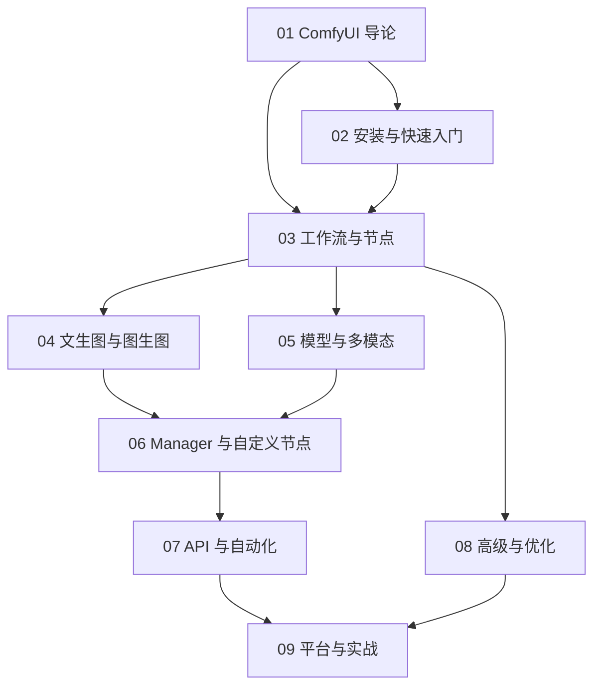

# ComfyUI 知识地图

## 分层学习路线

| 层级 | 技能 | 对应章节 |
|:--:|------|:--:|
| L1 | 理解 ComfyUI 定位与核心理念 | 01 |
| L2 | 安装、跑通首次出图 | 02 |
| L3 | 掌握工作流、节点、链接、子图 | 03 |
| L4 | 文生图/图生图、模型与多模态 | 04–05 |
| L5 | Manager/自定义节点、API、优化、实战 | 06–09 |

## 三条主线

| 主线 | 内容 |
|------|------|
| **图线** | 工作流 → 节点 → 链接 → 子图 → 部分执行 |
| **扩展线** | 自定义节点 → ComfyUI Manager |
| **集成线** | API → Comfy SDK → MCP → CLI → Cloud |

## 关联

[[004.8-ComfyUI]] · [[3 Resources/000-Knowledge/raw/articles/004.8-ComfyUI/wiki/index|Wiki 索引]] · [[3 Resources/000-Knowledge/raw/articles/004.8-ComfyUI/99-资源收集/资源总览|资源总览]]
