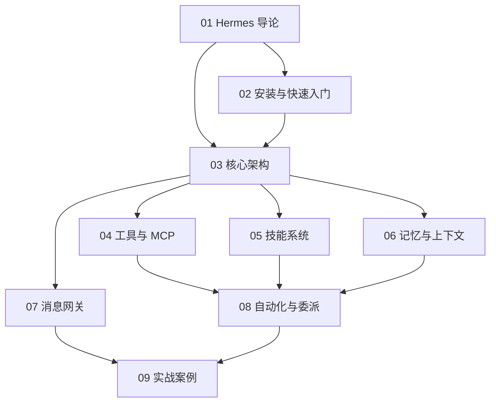

# Hermes Agent 知识地图

## 分层学习路线

| 层级 | 技能 | 对应章节 |
|:--:|------|:--:|
| L1 | 理解 Hermes Agent 定位与版本演进 | 01 |
| L2 | 安装、配置模型、跑通首次对话 | 02 |
| L3 | 掌握核心架构：AIAgent、工具集、技能、记忆 | 03–06 |
| L4 | 接入消息网关、自动化与委派 | 07–08 |
| L5 | 实战：简报机器人、PR 审查、并行研究、本地 LLM | 09 |

## 三条主线

| 主线 | 内容 |
|------|------|
| **能力线** | 工具/工具集 → MCP → 技能 → 记忆 → 消息网关 |
| **架构线** | AIAgent 循环 → 提示词组装 → 提供者解析 → 会话持久化 → 插件系统 |
| **自动化线** | Cron 定时任务 → 子代理委派 → 代码执行 → 事件钩子 → 批量处理 |

## 关联

[[004.8-Hermes-Agent]] · [[3 Resources/000-Knowledge/raw/articles/004.8-Hermes-Agent/wiki/index|Wiki 索引]] · [[3 Resources/000-Knowledge/raw/articles/004.8-Hermes-Agent/99-资源收集/资源总览|资源总览]]
