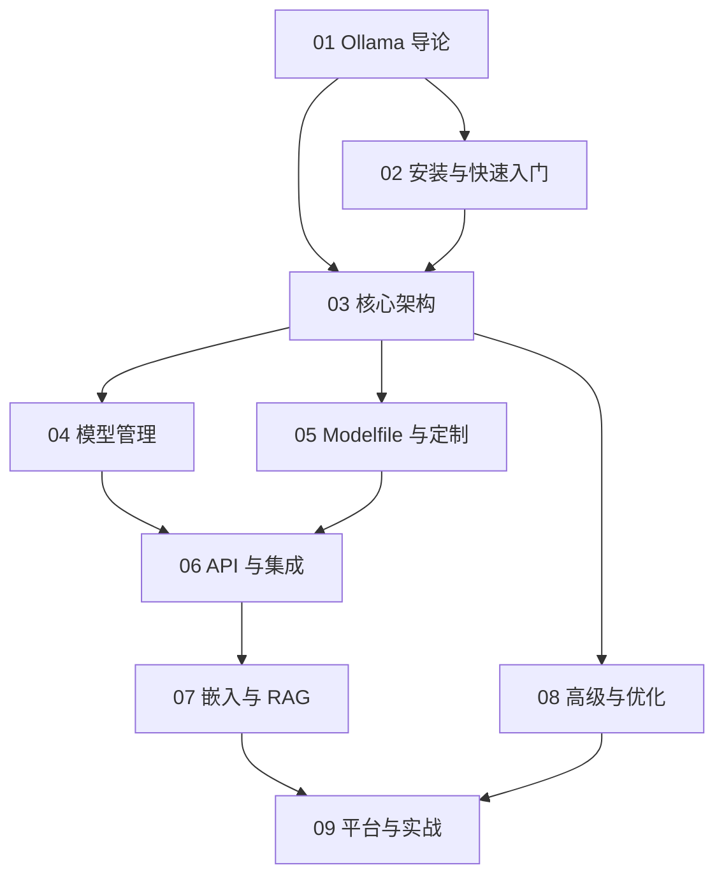

# Ollama 知识地图

## 分层学习路线

| 层级 | 技能 | 对应章节 |
|:--:|------|:--:|
| L1 | 理解 Ollama 定位与核心理念 | 01 |
| L2 | 安装、跑通首次模型运行 | 02 |
| L3 | 掌握架构、GGUF、量化 | 03 |
| L4 | 模型管理、Modelfile 定制、API | 04–06 |
| L5 | 嵌入/RAG、优化、平台实战 | 07–09 |

## 三条主线

| 主线 | 内容 |
|------|------|
| **运行线** | 模型 → 模型库 → GGUF → 量化 |
| **定制线** | Modelfile → 系统提示 → 自定义模型 → 工具调用 |
| **集成线** | CLI → REST API → OpenAI 兼容 → SDK → RAG → Open WebUI |

## 关联

[[004.8-Ollama]] · [[3 Resources/000-Knowledge/raw/articles/004.8-Ollama/wiki/index|Wiki 索引]] · [[3 Resources/000-Knowledge/raw/articles/004.8-Ollama/99-资源收集/资源总览|资源总览]]
