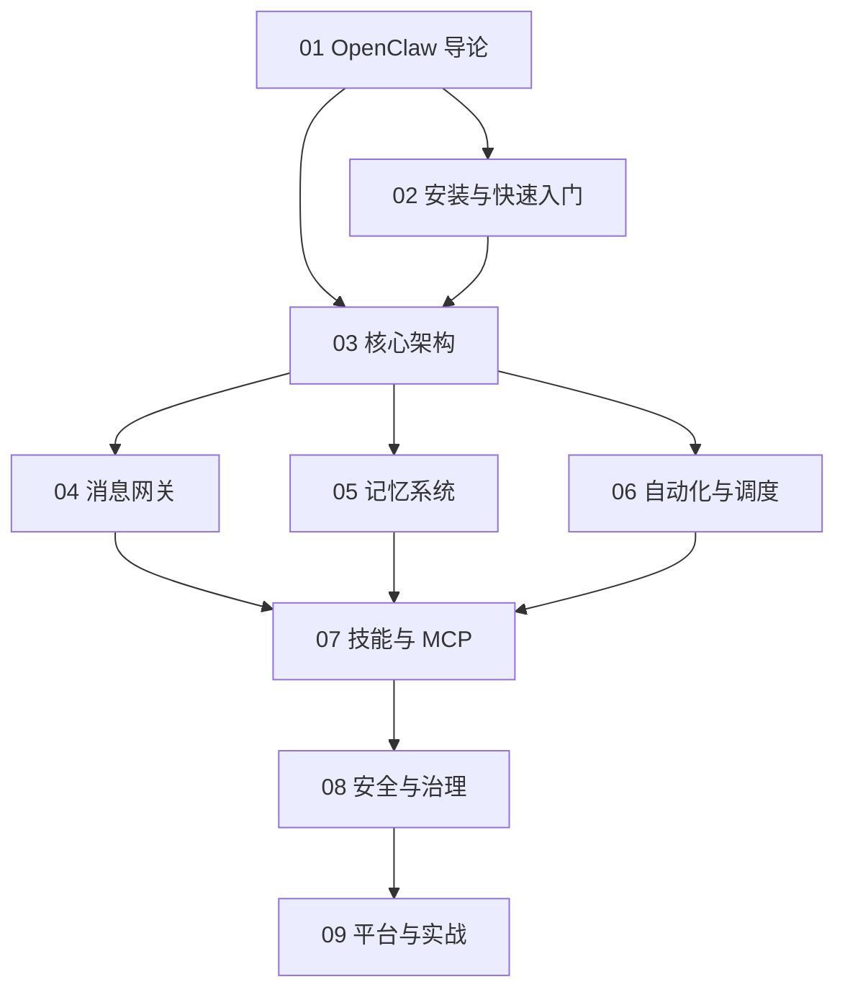

# OpenClaw 知识地图

## 分层学习路线

| 层级 | 技能 | 对应章节 |
|:--:|------|:--:|
| L1 | 理解 OpenClaw 定位与核心理念 | 01 |
| L2 | 安装、onboard、跑通首次对话 | 02 |
| L3 | 掌握双进程架构、消息网关 | 03–04 |
| L4 | 记忆系统、自动化调度 | 05–06 |
| L5 | 技能/MCP、安全治理、多平台实战 | 07–09 |

## 三条主线

| 主线 | 内容 |
|------|------|
| **架构线** | Gateway（控制面）→ Agent Runtime（执行面）→ Agent Loop |
| **能力线** | 消息渠道 → 记忆 → 自动化 → 技能/MCP |
| **安全线** | 审批 → 沙箱 → secrets → 多用户/配对 |

## 关联

[[004.8-OpenClaw]] · [[3 Resources/000-Knowledge/raw/articles/004.8-OpenClaw/wiki/index|Wiki 索引]] · [[3 Resources/000-Knowledge/raw/articles/004.8-OpenClaw/99-资源收集/资源总览|资源总览]]
