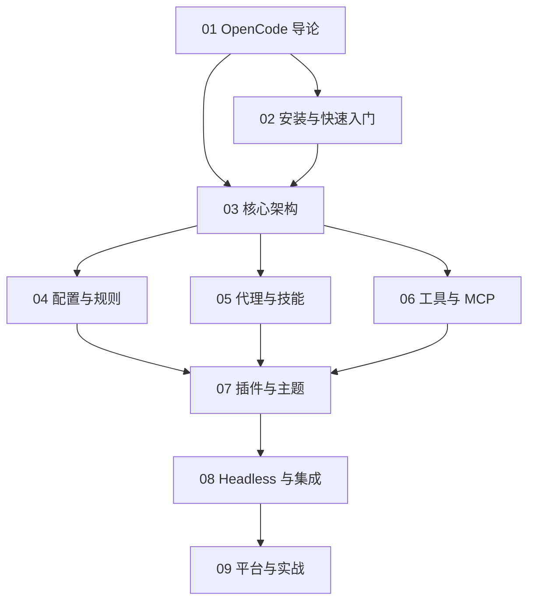

# OpenCode 知识地图

## 分层学习路线

| 层级 | 技能 | 对应章节 |
|:--:|------|:--:|
| L1 | 理解 OpenCode 定位与核心理念 | 01 |
| L2 | 安装、多提供者认证、跑通首次对话 | 02 |
| L3 | 掌握三模式架构、配置、规则 | 03–04 |
| L4 | 扩展系统：代理、技能、命令、MCP、插件 | 05–07 |
| L5 | Headless 集成、多平台实战 | 08–09 |

## 三条主线

| 主线 | 内容 |
|------|------|
| **核心线** | TUI/CLI/Server 三模式 → LSP → 多会话 |
| **扩展线** | 规则 → Agents → Skills → Commands → MCP → Plugins |
| **集成线** | opencode run → Server → SDK → ACP → GitHub/GitLab |

## 关联

[[004.8-OpenCode]] · [[3 Resources/000-Knowledge/raw/articles/004.8-OpenCode/wiki/index|Wiki 索引]] · [[3 Resources/000-Knowledge/raw/articles/004.8-OpenCode/99-资源收集/资源总览|资源总览]]
