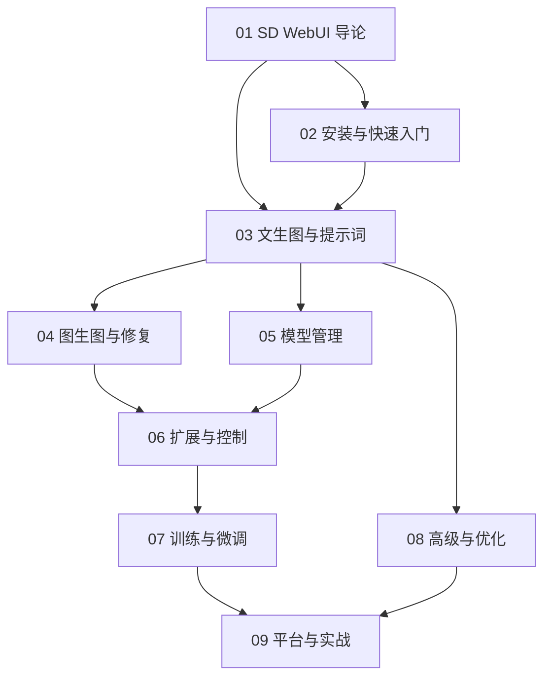

# Stable Diffusion Web UI 知识地图

## 分层学习路线

| 层级 | 技能 | 对应章节 |
|:--:|------|:--:|
| L1 | 理解 SD WebUI 定位与核心理念 | 01 |
| L2 | 安装、跑通首次出图 | 02 |
| L3 | 掌握 txt2img/img2img/inpainting | 03–04 |
| L4 | 模型管理、扩展与 ControlNet | 05–06 |
| L5 | 训练微调、高级优化、多平台实战 | 07–09 |

## 三条主线

| 主线 | 内容 |
|------|------|
| **生成线** | txt2img → img2img → inpainting |
| **模型线** | Checkpoint → LoRA → VAE → 合并 |
| **扩展线** | Extensions → ControlNet → 训练 → 优化 |

## 关联

[[004.8-Stable-Diffusion-WebUI]] · [[3 Resources/000-Knowledge/raw/articles/004.8-Stable-Diffusion-WebUI/wiki/index|Wiki 索引]] · [[3 Resources/000-Knowledge/raw/articles/004.8-Stable-Diffusion-WebUI/99-资源收集/资源总览|资源总览]]
