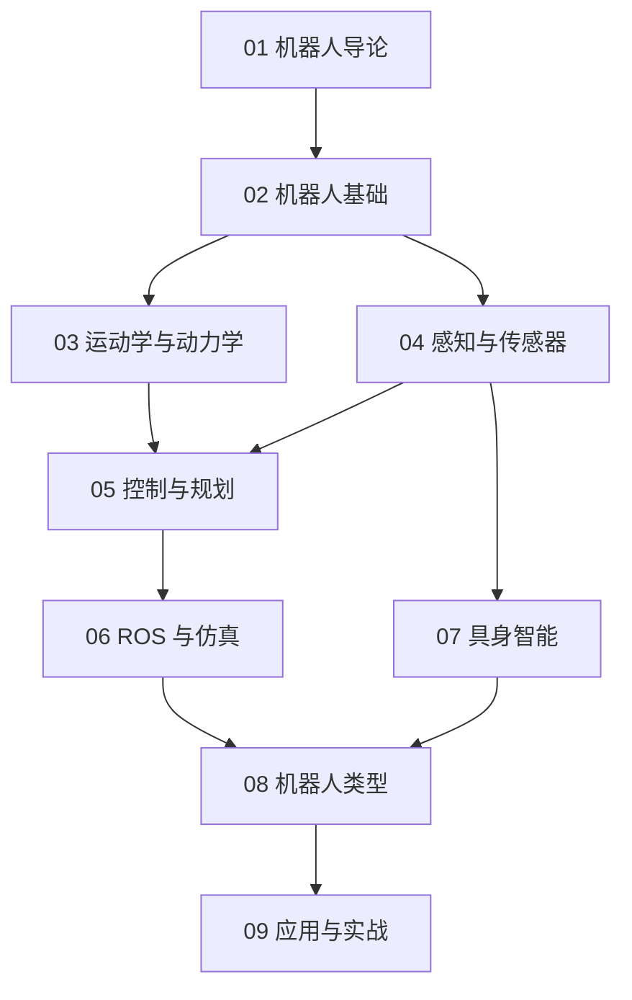

# 机器人知识地图

## 分层学习路线

| 层级 | 技能 | 对应章节 |
|:--:|------|:--:|
| L1 | 理解机器人定义、历史、分类 | 01 |
| L2 | 掌握结构、驱动器、传感器、控制器 | 02 |
| L3 | 运动学/动力学、感知与 SLAM | 03–04 |
| L4 | 控制规划、ROS 仿真、具身智能 | 05–07 |
| L5 | 机器人类型与应用实战 | 08–09 |

## 三条主线

| 主线 | 内容 |
|------|------|
| **感知线** | 传感器 → SLAM → 具身智能 |
| **控制线** | 运动学 → 动力学 → 控制 → 规划 |
| **软件线** | ROS/ROS2 → 仿真 → 部署 |

## 关联

[[007.52-Robotics-机器人]] · [[3 Resources/000-Knowledge/raw/articles/007.52-Robotics-机器人/wiki/index|Wiki 索引]] · [[3 Resources/000-Knowledge/raw/articles/007.52-Robotics-机器人/99-资源收集/资源总览|资源总览]]
