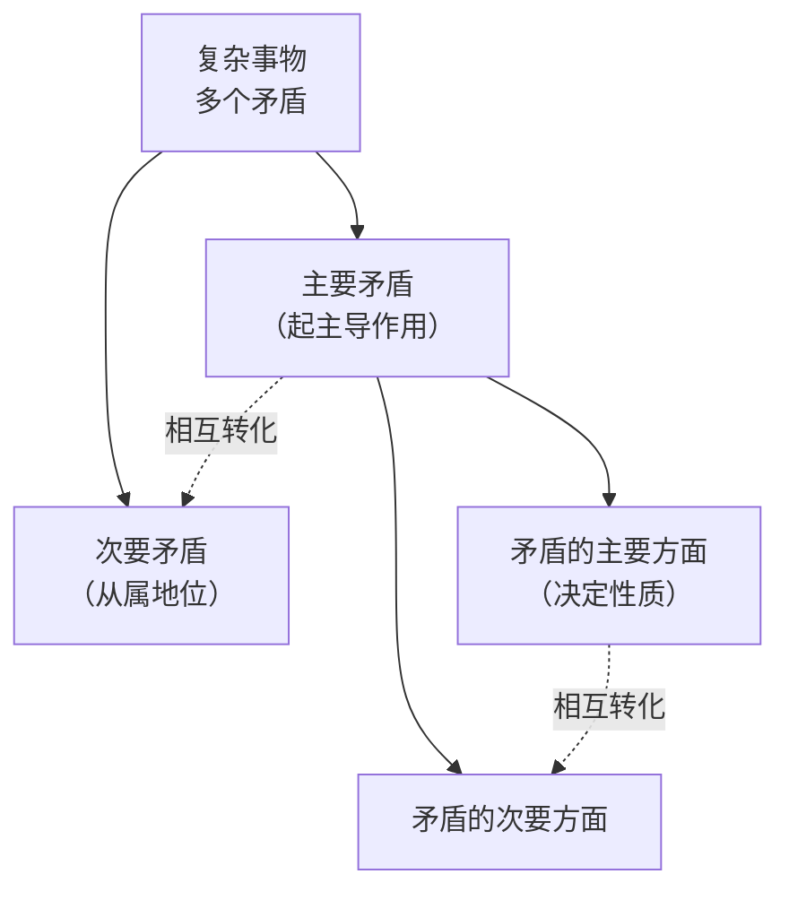

# 矛盾论

> **"事物的矛盾法则，即对立统一的法则，是唯物辩证法的最根本的法则。"** — 毛泽东，1937 年 8 月

> 与《实践论》并称毛泽东哲学思想的「两论」，系统阐述了唯物辩证法的核心——对立统一规律。它回答的根本问题是：**如何认识和分析事物内部的矛盾，从而找到解决问题的钥匙。**

---

## 基本信息

| 项目 | 内容 |
|:--|:--|
| **作者** | 毛泽东（1893–1976） |
| **成稿时间** | 1937 年 8 月 |
| **性质** | 延安抗日军事政治大学《辩证法唯物论（讲授提纲）》第三章第一节 |
| **收录** | 《毛泽东选集》第一卷 |
| **写作目的** | 克服党内严重的**教条主义**思想 |
| **历史地位** | 与《实践论》合称「两论」，马克思主义哲学中国化的标志性成果 |

---

## 著作结构（六个问题）

| # | 章节 | 核心命题 |
|:--|:--|:--|
| 1 | **两种宇宙观** | 形而上学 vs 唯物辩证法；内因是变化的根据 |
| 2 | **矛盾的普遍性** | 矛盾存在于一切事物、贯穿一切过程 |
| 3 | **矛盾的特殊性** | 不同质的矛盾用不同质的方法解决 |
| 4 | **主要的矛盾和主要的矛盾方面** | 抓主要矛盾，分清主次 |
| 5 | **矛盾诸方面的同一性和斗争性** | 对立双方既统一又斗争 |
| 6 | **对抗在矛盾中的地位** | 对抗只是矛盾斗争的一种形式 |

---

## 核心思想

### 1. 两种宇宙观

| 宇宙观 | 发展观 | 根源 |
|:--|:--|:--|
| **形而上学** | 孤立、静止、片面地看问题；发展是数量的增减和位置的移动 | 外部原因 |
| **唯物辩证法** | 联系、发展、全面地看问题；发展是事物内部矛盾运动的结果 | 内部矛盾 |

> **内因是变化的根据，外因是变化的条件，外因通过内因而起作用。**

### 2. 矛盾的普遍性（共性）

矛盾无处不在、无时不有：
- 存在于**一切事物**的发展过程中
- 存在于每一事物发展过程的**始终**

> 「没有矛盾就没有世界。」

### 3. 矛盾的特殊性（个性）

| 层次 | 含义 |
|:--|:--|
| 不同事物 | 各有其特殊矛盾，构成一事物区别于他事物的本质 |
| 同一事物不同阶段 | 矛盾在发展中呈现不同形态 |
| 矛盾各方面 | 每个矛盾方面都有其特殊性 |

> **「不同质的矛盾，只有用不同质的方法才能解决。」** — 这是反对教条主义的根本论据。

> **「共性个性、绝对相对的道理，是关于事物矛盾的问题的精髓，不懂得它，就等于抛弃了辩证法。」**

### 4. 主要矛盾与矛盾的主要方面

- **矛盾发展不平衡**是主次区分的客观依据
- **抓主要矛盾** = 抓住事物发展的关键、纲举目张
- 主次矛盾、主次方面在一定条件下**相互转化**

> 方法论意义：「研究任何过程，如果是存在着两个以上矛盾的复杂过程的话，就要用全力找出它的主要矛盾。捉住了这个主要矛盾，一切问题就迎刃而解了。」

### 5. 同一性与斗争性

| 属性 | 含义 | 关系 |
|:--|:--|:--|
| **同一性** | 对立双方相互依存、相互贯通、在一定条件下相互转化 | 相对的、有条件的 |
| **斗争性** | 对立双方相互排斥、相互对立 | 绝对的、无条件的 |

> 「有条件的相对的同一性和无条件的绝对的斗争性相结合，构成了一切事物的矛盾运动。」

### 6. 对抗在矛盾中的地位

- **对抗**只是矛盾斗争的一种形式，而非唯一形式
- 对抗性矛盾与非对抗性矛盾可以**相互转化**
- 解决矛盾的方法因矛盾性质而异

---

## 核心金句

- 「没有矛盾就没有世界」
- 「内因是变化的根据，外因是变化的条件」
- 「不同质的矛盾，只有用不同质的方法才能解决」
- 「共性个性、绝对相对的道理，是关于事物矛盾的问题的精髓」
- 「捉住了主要矛盾，一切问题就迎刃而解了」
- 「一分为二」

---

## 历史意义

1. **批判教条主义** — 为党内「具体问题具体分析」的实事求是路线奠定哲学基础
2. **哲学中国化** — 用中国革命经验丰富和发展了马克思主义辩证法
3. **方法论武器** — 成为此后分析一切政治、军事、经济问题的根本方法
4. **与《实践论》互补** — 实践论解决「认识的来源」，矛盾论解决「认识的方法」，合称「两论」

---

## 方法论启示（矛盾分析法的应用）

「矛盾分析法」是这个 vault 最值得内化的思维工具之一：

| 场景 | 矛盾分析法的映射 |
|:--|:--|
| **交易/量化** | 主要矛盾 = 趋势方向；次要矛盾 = 入场时机、仓位大小。抓住「主要矛盾」（行情性质）再谈细节 |
| **知识管理** | 普遍性 = 通用方法论；特殊性 = 每个领域的具体规则。**不同质的笔记用不同质的方法处理**（这正是 PARA/LYT/Zettel 分模式的哲学依据） |
| **项目决策** | 内因（自身能力/系统质量）是根本，外因（市场/环境）是条件。**先抓内因，再借外因** |
| **冲突分析** | 同一性 = 双方利益交汇点；斗争性 = 分歧点。找「主要矛盾」而非纠缠「次要矛盾」 |
| **学习** | 「共性个性」= 抽象规律 + 具体案例。只学共性则空，只记个性则碎 |

> 本 vault 的「方法论模式」体系（PARA / LYT / Zettel / Generic）本质上就是「矛盾特殊性」原则的应用——**不同质的笔记，用不同质的方法组织。**

---

## 关联

- [[实践论]] — 认识论姊妹篇（1937），合称「两论」
- [[论持久战]] — 矛盾分析法在军事战略中的应用（1938）
- [[政治哲学]] — 所属学科域
- [[马克思]] — 思想根源（唯物辩证法）

---

## 参考来源

- 毛泽东，《矛盾论》（1937），《毛泽东选集》第一卷
- [中文马克思主义文库：矛盾论](https://www.marxists.org/chinese/maozedong/marxist.org-chinese-mao-193708.htm)
- [东南大学理论学习平台：毛泽东《矛盾论》](https://zhishan.seu.edu.cn/2012/1113/c9000a74546/page.htm)
