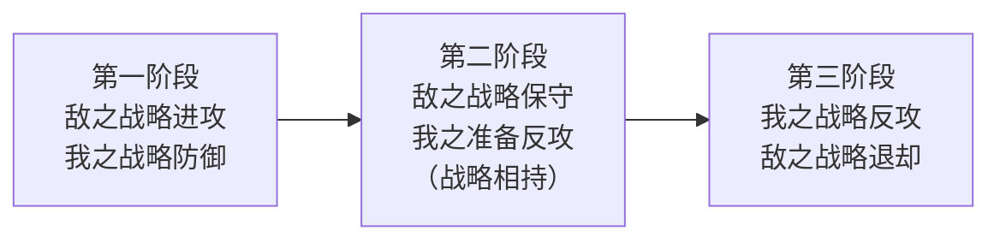

# 论持久战

> **"抗日战争是持久战，最后胜利是中国的。"** — 毛泽东，1938 年 5 月

> 一部关于「弱者如何在长期对抗中战胜强者」的战略哲学著作，其「三个阶段」「敌我矛盾分析」「主动性与计划性」等思想早已超越军事领域，成为普遍的方法论。

---

## 基本信息

| 项目 | 内容 |
|:--|:--|
| **作者** | 毛泽东（1893–1976） |
| **成稿时间** | 1938 年 5 月 26 日 – 6 月 3 日 |
| **性质** | 延安抗日战争研究会上的长篇演讲 |
| **首次发表** | 1938 年 7 月 1 日《解放》第 43、44 期合刊 |
| **收录** | 1952 年《毛泽东选集》第二卷 |
| **篇幅** | 21 个问题，120 段，分两大部分 |
| **历史地位** | 中国共产党领导抗日战争的纲领性文献，抗战时期影响最大的著作 |

---

## 著作结构（21 问）

全文围绕两个根本问题展开：**「为什么是持久战、为什么最后胜利是中国」**（第一部分）与 **「怎样进行持久战、怎样争取胜利」**（第二部分）。

### 第一部分：认识论 — 为什么？（第 1–9 问）

1. 问题的提起
2. 问题的根据
3. 驳亡国论
4. 妥协还是抗战？腐败还是进步？
5. 亡国论是不对的，速胜论也是不对的
6. 为什么是持久战？
7. **持久战的三个阶段**
8. 犬牙交错的战争
9. 为永久和平而战

### 第二部分：方法论 — 怎么办？（第 10–21 问）

10. 能动性在战争中
11. 战争和政治
12. 抗日的政治动员
13. 战争的目的
14. 防御中的进攻，持久中的速决，内线中的外线
15. **主动性，灵活性，计划性**
16. 运动战，游击战，阵地战
17. 消耗战，歼灭战
18. 乘敌之隙的可能性
19. 抗日战争中的决战问题
20. **兵民是胜利之本**
21. 结论

---

## 核心论点

### 四个基本特点（矛盾分析）

毛泽东用「矛盾分析法」剖析中日双方，得出四个互相对立的基本特点：

| 维度 | 日本（敌） | 中国（我） |
|:--|:--|:--|
| **强弱** | 强（军力、经济力、组织力） | 弱 |
| **进退** | 退步、野蛮（侵略战争） | 进步（正义的民族解放战争） |
| **大小** | 小国（人力物力有限） | 大国（地大物博人多） |
| **助寡助** | 寡助（失道） | 多助（得道） |

> **由此推出：「敌强我弱」决定战争不能速胜；「敌退步我进步、敌小我大、敌寡助我多助」决定中国不会亡，最后胜利必属中国。**

### 批驳两种错误论调

| 错误论调 | 实质 | 危害 |
|:--|:--|:--|
| **亡国论** | 只见「敌强我弱」，不见其他三对矛盾 | 投降主义，丧失信心 |
| **速胜论** | 只见「我进步、敌退步」，无视「敌强我弱」 | 轻敌冒进，一遇挫折即转失望 |

---

## 三个阶段（核心预见）

| 阶段 | 敌我态势 | 关键特征 | 历史验证 |
|:--|:--|:--|:--|
| **一：战略防御** | 敌攻我守 | 敌企图速决，我以空间换时间 | 1937–1938，广州、武汉失守为终点 |
| **二：战略相持** | 敌保守我准备 | 最艰苦漫长，敌后游击战成为主战场 | 1938–1944，根据地「犬牙交错」 |
| **三：战略反攻** | 我反攻敌退却 | 国际反法西斯形势配合 | 1944–1945 |

> 毛泽东将其比作抗战的「三幕戏」。三个阶段并非机械划分，而是**犬牙交错**、相互渗透。

---

## 战略方针（方法论精华）

### 三大关系

| 关系 | 原则 |
|:--|:--|
| **防御 vs 进攻** | 战略防御中的战役/战斗进攻 |
| **持久 vs 速决** | 战略持久中的战役/战斗速决 |
| **内线 vs 外线** | 战略内线中的战役/战斗外线作战 |

### 作战形式

- **运动战为主**（第一阶段）、**游击战为主**（第二阶段）、**阵地战为辅助**
- 八路军方针：**「基本的是游击战，但不放松有利条件下的运动战」**

### 三大品质

> **主动性、灵活性、计划性** — 这三者被毛泽东并列为战争指导的三大核心能力。

| 品质 | 内涵 |
|:--|:--|
| **主动性** | 掌握主动权，「你打你的，我打我的」 |
| **灵活性** | 因敌制变，不死守教条 |
| **计划性** | 战略上藐视，战术上重视；不打无准备之仗 |

### 人民战争

> **「兵民是胜利之本」** — 战争的伟力之最深厚的根源，存在于民众之中。

- 政治动员是抗战第一等大事
- 军队须与民众打成一片，而非脱离群众
- 统一战线是总方针

---

## 核心金句

- 「战争是政治的继续」
- 「敌进我退，敌驻我扰，敌疲我打，敌退我追」（游击战十六字诀）
- 「战略上藐视敌人，战术上重视敌人」
- 「没有调查就没有发言权」（同期的认识论原则，见 [[实践论]]）
- 「我们是一切困难都要战胜的，但不能说困难不是困难」

---

## 历史意义

1. **统一思想** — 在抗战最迷茫时期，用科学分析回答了「能不能胜、多久胜、怎么胜」三大问题
2. **指导实践** — 直接指导了敌后抗日根据地的游击战战略
3. **预见性典范** — 三个阶段、犬牙交错、汪伪政权等预见后来均被历史证实
4. **方法论遗产** — 「矛盾分析法」「阶段论」「以弱胜强的持久战略」成为普遍性的分析框架

---

## 方法论启示（超越军事）

论持久战的战略思想，可迁移到一切「长期、艰难、非对称」的对抗/积累场景：

| 领域 | 「持久战」的映射 |
|:--|:--|
| **交易/量化** | 长期主义：接受回撤（战略防御），在持续学习中等待优势兑现（战略反攻）；不追「速胜」（追涨杀跌），不堕「亡国」（一次爆仓离场） |
| **知识管理** | 知识积累是持久战：拒绝「速成论」，坚持「每日输出」的游击战式积累 |
| **创业/项目** | 认清「敌强我弱」的初期现实，用「阶段论」规划，而非幻想一夜成功 |
| **个人成长** | 「主动性、灵活性、计划性」= 自我驱动的三大支柱 |

> 本 vault 的交易与知识管理实践，本质上都是一场「持久战」。

---

## 关联

- [[实践论]] — 认识论基础（1937），与之构成「认识—战略」姊妹篇
- [[政治哲学]] — 所属学科域
- [[马克思]] — 思想根源（马克思主义战争观）
- [[矛盾论]] — 方法论基础（1937），「四个特点」即矛盾分析法的应用

---

## 参考来源

- 毛泽东，《论持久战》（1938），《毛泽东选集》第二卷
- [百度百科：论持久战](https://baike.baidu.com/item/%E8%AE%BA%E6%8C%81%E4%B9%85%E6%88%98/365843)
- [「抗日战争是持久战，最后胜利是中国的」— 中国档案资讯网](http://www.zgdazxw.com.cn/culture/2023-02/14/content_339587.html)
