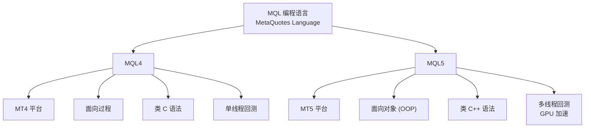

# MQL4 与 MQL5 知识库导航

> **Map of Content** — 本 vault 中所有 MQL 编程相关知识的统一入口。
> 姊妹导航：[[MetaTrader 知识库总览]] | [[MetaTrader 学习路径]]

---

## 🎯 快速导航

| 你想做什么？ | 从这里开始 |
|:--|:--|
| 🔰 **从零学 MQL** | → [[#🟢-初学者路径-1-2-个月]] |
| ⚡ **快速对比 MQL4 vs MQL5** | → [[#📊-MQL4-vs-MQL5]] |
| 🔨 **开发一个 EA** | → [[Expert Advisor基础]] · [[MQL5_OOP价格行为]] |
| 📈 **写一个技术指标** | → [[自定义指标开发]] · [[MQL5_自定义Donchian指标]] |
| 🎨 **给 EA 加 GUI 面板** | → [[#🖥️-GUI-图形界面开发]] |
| 🧠 **AI / 机器学习集成** | → [[#🤖-AI-与机器学习]] |
| 📚 **查官方 API** | → [[#📖-MQL4-官方文档]] |
| 🔗 **Python + MQL5** | → [[MQL5_Python集成]] · [[Python-MQL5交易机器人]] |

---

## 📊 MQL4 vs MQL5



| 特性 | MQL4 | MQL5 |
|:--|:--|:--|
| **平台** | MetaTrader 4 | MetaTrader 5 |
| **编程范式** | 面向过程 | 面向对象 (OOP) |
| **执行速度** | 基准 | **快 ~20 倍** |
| **事件模型** | `start()` / `OnTick()` | 10+ 事件类型 (`OnTrade`, `OnTimer`, `OnChartEvent`…) |
| **指标缓冲区** | 有限 | 512 个（无限制） |
| **市场深度 (DOM)** | ❌ | ✅ |
| **时间框架** | 9 种 | 21 种 |
| **多品种交易** | 困难 | ✅ 原生支持 |
| **回测** | 单线程 | 多线程 + 分布式 |
| **OpenCL GPU** | ❌ | ✅ |
| **云存储** | ❌ | ✅ MQL5 Storage |

### 什么时候选哪个？

| 选 MQL4 | 选 MQL5 |
|:--|:--|
| ✅ 使用 MT4 平台 | ✅ 使用 MT5 平台 |
| ✅ 简单 EA / 指标开发 | ✅ 复杂多品种交易系统 |
| ✅ 兼容性要求高 | ✅ 需要 GPU 加速 / 高频 |
| ✅ 面向过程编程习惯 | ✅ 面向对象编程习惯 |

> 详细对比见：[[MQL4_vs_MQL5]] · [[MQL]]

---

## 🗺️ 学习路径

### 🟢 初学者路径 (1–2 个月)


| 步骤 | 学习内容 | 推荐阅读 |
|:--|:--|:--|
| 1 | 环境搭建 | [[MQL4环境搭建与工具配置]] |
| 2 | 语法基础 | [[MQL4基础语法与数据类型]] · [[MQL4函数与控制流]] |
| 3 | 交易操作 | [[MQL4交易操作基础]] |
| 4 | 第一个 EA | [[Expert Advisor基础]] |
| 5 | 调试 | [[调试与错误处理]] · [[MQL5_调试与跟踪]] |

### 🟡 进阶路径 (3–6 个月)


| 技能 | 推荐阅读 |
|:--|:--|
| MQL5 OOP | [[MQL5_OOP入门]] · [[MQL5_OOP价格行为]] |
| 策略开发 | [[MQL5_Donchian通道交易]] · [[MQL5_Fibonacci交易系统]] · [[MQL5_ATR交易系统]] |
| 资金管理 | [[MQL5盈亏平衡机制]] · [[MQL5_追踪止损]] · [[跟踪止损赚钱算法]] |
| 回测 | [[MQL5_前行优化自动器]] · [[前行优化自动优化器]] |

### 🔴 专家路径 (6–12 个月)


| 领域 | 推荐阅读 |
|:--|:--|
| 神经网络 | [[深度神经网络-MQL5系列]] · [[MQL5_神经网络自我优化EA]] · [[MQL5_Hlaiman神经网络EA]] |
| LLM 集成 | [[MQL5_LLM集成EA]] · [[MQL5_LLM硬件环境]] · [[LLM集成EA-CPU训练]] |
| OpenCL | [[MQL5_OpenCL入门]] · [[MQL5_OpenCL计算]] · [[MQL5_OpenCL进阶]] |
| Python 混合 | [[MQL5_Python集成]] · [[Python-MQL5交易机器人]] · [[Python-MQL5多模块机器人]] |
| 数值计算 | [[MQL5_ALGLIB数值库]] · [[MQL5_ENCOG机器学习]] · [[MQL5_MATLAB交互]] |

---

## 📚 知识分类索引

### 🏗️ 基础语法

> `raw/articles/MetaTrader/07-MQL编程/01-MQL4基礎/`

- [[MQL4环境搭建与工具配置]] — IDE 安装与项目创建
- [[MQL4基础语法与数据类型]] — 变量、常量、类型系统
- [[MQL4函数与控制流]] — 条件判断、循环、函数定义
- [[MQL4交易操作基础]] — OrderSend、订单管理
- [[调试与错误处理]] — Debug 技巧与常见错误

### ⚙️ 核心开发

> `raw/articles/MetaTrader/07-MQL编程/02-MQL4核心/`

- [[Expert Advisor基础]] — EA 框架与生命周期
- [[自定义指标开发]] — 指标缓冲区与绘图

### 📖 MQL4 官方文档

> `raw/articles/MetaTrader/07-MQL编程/00-MQL4官方文档/`

| 章节 | 内容 |
|:--|:--|
| 01-语言基础 | 语法、类型、运算符、变量、预处理、OOP |
| 02-标准常量 | 对象常量、指标常量、交易常量、错误码 |
| 03-MQL4程序 | 程序结构、运行、事件、导入、测试 |
| 04-预定义变量 | `_Digits`, `_Point`, `_Symbol`, `_Period` 等 |
| 05-普通函数 | Comment, Crypt, Debug, Expert 等 |
| 19-文件函数 | FileOpen, FileRead, FileWrite 系列 |

### 🧠 核心概念 (Wiki)

- [[MQL]] — MQL 语言总览概念
- [[MQL4]] — MQL4 实体页
- [[MQL5]] — MQL5 实体页
- [[EA从零开发系列]] — 系列教程

### 🤖 AI 与机器学习

- [[MQL5_LLM集成EA]] · [[MQL5_LLM硬件环境]] · [[LLM集成EA-CPU训练]] · [[LLM集成EA-GPU训练]] · [[LLM集成EA微调]]
- [[深度神经网络-MQL5系列]] · [[MQL5深度网络]]
- [[MQL5_神经网络自我优化EA]] · [[MQL5_Hlaiman神经网络EA]] · [[MQL5_NeuroPro神经网络]]
- [[Kohonen神经网络-MQL5优化预测]] · [[MQL5_遗传算法自我优化]]
- [[MQL5_ENCOG机器学习]] · [[MQL5_贝叶斯SSA预测]] · [[MQL5_逻辑回归]]
- [[GAN合成金融数据]]

### 📈 交易策略

**趋势跟踪：**
- [[MQL5_Donchian通道交易]] · [[MQL5_自定义Donchian指标]]
- [[MQL5_BoS策略]] · [[MQL5_Gann趋势指标]]
- [[MQL5_NRTR指标]] · [[MQL5_WilliamBlau指标]]
- [[MQL5_非滞后滤波器]] · [[MQL5_数字滤波器]]

**震荡/均值回归：**
- [[MQL5_Stochastic交易系统]] · [[MQL5_ADX交易系统]]
- [[MQL5_ATR交易系统]] · [[MQL5_80-20交易策略]]
- [[MQL5_ZScore引擎]] · [[MQL5_赫斯特指数]]

**形态识别：**
- [[MQL5_蜡烛形态分析]] · [[MQL5_Merrill形态]] · [[MQL5_美林Merrill形态]]
- [[MQL5_头肩形态]] · [[MQL5_双顶双底]]
- [[MQL5_纺锤形图表指标]] · [[MQL5_点数图指标]]

**斐波那契 / DiNapoli：**
- [[MQL5_Fibonacci交易系统]] · [[MQL5_DiNapoli交易]] · [[MQL5_DiNapoli交易系统]]

**艾略特波浪：**
- [[MQL5艾略特波浪自动分析]]

### 🔗 集成与互操作

- [[MQL5_Python集成]] · [[Python-MQL5交易机器人]] · [[Python-MQL5多模块机器人]]
- [[MQL5_MATLAB交互]] · [[MQL5_MATLAB2018]]
- [[MQL5_MySQL数据库访问]]
- [[MQL5_正则表达式]]
- [[MQL5_OLAP报价分析]] · [[OLAP交易分析系列]]
- [[MQL5_可视化交易图表]] · [[MQL5_交互式仪表板]]

### 🛡️ 风控与资金管理

- [[MQL5盈亏平衡机制]] · [[MQL5_追踪止损]] · [[MQL5_追踪止损开发]]
- [[MQL5_Martingale区域恢复]] · [[MQL5_网格对冲优化]]
- [[MQL5_余额净值分析]] · [[MQL5_余额图优化]]
- [[MQL5_风险评估]] · [[MQL5_限价订单替代止盈]]
- [[MQL5_ParabolicSAR止损]]
- [[MQL5_回放系统]] · [[MQL5_回放系统续]]

### 🎯 专项技术

**GUI 面板：**
- [[MQL5_可移动GUI]] · [[MQL5_可移动交易GUI]] · [[MQL5_拖放半自动EA]]
- [[MQL-EA交易GUI面板]] · [[MQL-HedgeTerminal对冲面板]]
- [[MQL-CCanvas自定义图形控件]] · [[MQL-CGraphic标准图形库]]
- [[CGraphic剥头皮市场深度]]

**代码质量：**
- [[MQL5错误处理与日志]] · [[MQL5_调试与跟踪]]
- [[MQL5_代码安全保护]] · [[MQL5_代码自动文档]]
- [[MQL5对象创建析构顺序]] · [[MQL5_OnTrade事件处理]]

**跨平台：**
- [[风险控制跨平台EA]] · [[开发跨平台网格EA]] · [[CUnIndicator与跨平台停止位]]

---

## 🖥️ GUI 图形界面开发

> 完整系列见：[[_index|MQL 图形界面库]] — EasyAndFastGUI 库
> 作者：[[3 Resources/People/wiki/entities/Anatoli-Kazharski-tol64|Anatoli Kazharski (tol64)]]

| 篇 | 主题 | 编译笔记 |
|:--|:--|:--|
| I | 库结构与动画 | [[MQL图形界面I-库结构]] |
| II | 菜单系统 | [[MQL图形界面II-菜单系统]] |
| III | 按钮系统 | [[MQL图形界面III-按钮系统]] |
| IV | 信息元件与多窗口 | [[MQL图形界面IV-信息元件与多窗口]] |
| V | 滚动条与列表视图 | [[MQL图形界面V-滚动条与列表视图]] |
| VI | 复选框与编辑框 | [[MQL图形界面VI-复选框与编辑框]] |
| VII | 表格与页面控件 | [[MQL图形界面VII-表格与页面控件]] |
| VIII | 日历与树形视图 | [[MQL图形界面VIII-日历与树形视图]] |
| IX | 颜色选择器与图表 | [[MQL图形界面IX-颜色选择器与图表]] |
| X | Build 2–3 更新 | [[MQL图形界面X-库更新Build2-3]] |
| XI | 渲染控件与标准图形库 | [[MQL图形界面XI-渲染控件与标准图形库]] |

---

## 🔬 项目分析

- [[MQL4交易代码库分析]] — 交易代码库快速审计
- [[MQL4交易代码库完整分析报告]] — 完整深度分析
- [[MQL5人工交易助手]] — GUI 人工交易面板

---

## 💻 快速上手

### 你的第一个 EA（MQL4）

```cpp
//+------------------------------------------------------------------+
//|                                                MyFirstEA.mq4     |
//+------------------------------------------------------------------+
#property copyright "Your Name"
#property version   "1.00"
#property strict

int OnInit() {
   Print("Hello, MQL4!");
   return(INIT_SUCCEEDED);
}

void OnDeinit(const int reason) {
   Print("Goodbye!");
}

void OnTick() {
   double bid = MarketInfo(Symbol(), MODE_BID);
   double ask = MarketInfo(Symbol(), MODE_ASK);
   Comment("Bid: ", bid, " | Ask: ", ask);
}
```

### 你的第一个 EA（MQL5）

```cpp
//+------------------------------------------------------------------+
//|                                                MyFirstEA.mq5     |
//+------------------------------------------------------------------+
#property copyright "Your Name"
#property version   "1.00"

input double LotSize = 0.1;   // 手数
input int    StopLoss = 200;  // 止损点数

int OnInit() {
   Print("Hello, MQL5!");
   return(INIT_SUCCEEDED);
}

void OnTick() {
   double bid = SymbolInfoDouble(_Symbol, SYMBOL_BID);
   double ask = SymbolInfoDouble(_Symbol, SYMBOL_ASK);
   Comment("Bid: ", bid, " | Ask: ", ask);
}
```

### 开发工具选择

| 场景 | 推荐工具 | 适用人群 |
|:--|:--|:--|
| MQL4 开发 | MetaEditor 4 | MT4 用户 |
| MQL5 开发 | MetaEditor 5 | MT5 用户 |
| 专业开发 | VS Code + MQL 扩展 | 专业开发者 |
| 快速原型 | MQL 在线编辑器 | 学习者 |

---

## 🌐 社区与生态

| 资源 | 链接 | 说明 |
|:--|:--|:--|
| 官方文档 | [MQL5.com/docs](https://www.mql5.com/en/docs) | MQL4/MQL5 完整 API |
| 代码库 | [MQL5.com/code](https://www.mql5.com/en/code) | 免费源码与模板 |
| 应用市场 | [MQL5.com/market](https://www.mql5.com/en/market) | 10,000+ 交易产品 |
| 自由职业 | [MQL5.com/jobs](https://www.mql5.com/en/jobs) | 程序员接单平台 |
| 论坛 | [MQL5.com/forum](https://www.mql5.com/en/forum) | 技术问答 |
| 策略测试 | MQL5 Cloud Network | 分布式回测计算 |

---

## 📊 学习进度追踪

### 成就系统

- 🥉 **新手村**：完成 MQL 基础语法学习
- 🥈 **策略师**：开发第一个可运行的 EA
- 🥇 **架构师**：掌握 OOP + 多品种交易
- 👑 **大师**：AI 驱动的自适应交易系统

### 技能自检

- [ ] **语法掌握**：95% 以上准确率
- [ ] **策略开发**：独立完成中等复杂度 EA
- [ ] **回测优化**：理解过拟合与前行优化
- [ ] **风险控制**：仓位计算、止损逻辑
- [ ] **实盘验证**：模拟账户稳定盈利

---

## 🔗 相关导航

- [[MetaTrader 知识库总览]] — 平台整体知识地图
- [[MetaTrader 学习路径]] — 从零到精通的完整路线
- [[07-MQL 编程]] — MQL 编程总览页
- [[MQL]] — 概念页
- [[MQL4]] · [[MQL5]] — 实体页
- [[_index|MQL 图形界面库]] — GUI 系列总目录

---

*创建: 2026-02-01 | 最后优化: 2026-07-19*
*分类: 3 Resources / 332.6-Investment-and-Trading*
