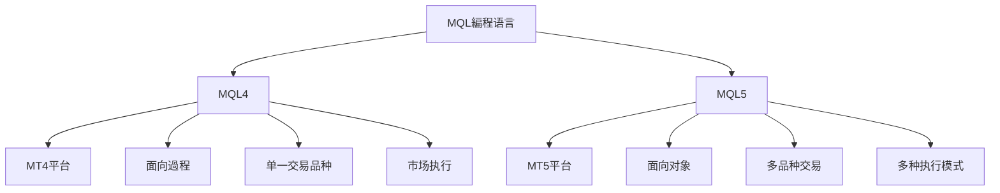

---
# 知識庫
status: active
priority: high
tags: [resource/tech/programming/mql, mql, mql4, mql5, trading]
# 指南
created: 2026-02-01
updated: 2026-06-10
---

# 知識庫

# 知識

## 🎯 學習目標

- **初学者**：从零開始掌握MQL4/MQL5編程基礎
- **交易者**：學習編寫自動化交易策略和指标
- **開發者**：掌握MQL在量化交易中的深度應用程式

## 📚 MQL4 vs MQL5

# 版本


### 主要差异
| 特性 | MQL4 | MQL5 |
|-----|------|------|
| 平台 | MetaTrader 4 | MetaTrader 5 |
| 編程范式 | 面向過程 | 面向对象 |
# 管理
| 指标缓冲区 | 指标缓冲区数组 | 指标缓冲区数组 |
| 事件處理 | start() | OnTick() |
| 市场深度 | 不支持 | 支持 |
| 多线程 | 不支持 | 部分支持 |

# 知識庫

### 🔰 01 基礎入门
# 配置
[[MQL4基礎语法与數據类型]] - 语言核心语法和數據结构
[[MQL4函数与控制流]] - 条件判斷、循环和函数定义
# 管理
[[MQL5面向对象編程]] - 类、对象、继承与多态
[[除錯与错误處理]] - 代碼除錯和错误處理機制

### 🔨 02 核心功能
#### 指标開發
# 分析
# 管理
# 分析
[[指标信号系統]] - 交易信号生成和警报

#### EA開發
[[Expert Advisor基礎]] - EA框架和生命周期
[[交易策略實現]] - 常见交易策略編程
# 管理
# 方法

# 分析
#### 技術指标
[[移动平均线策略]] - MA交易系統開發
[[MACD指标應用程式]] - 趨勢跟踪策略
[[RSI策略開發]] - 超买超卖策略
[[布林带策略]] - 波动率交易策略
[[多重指标组合]] - 多指标协同策略

# 分析
# 分析
[[支撑阻力识别]] - 關鍵价位识别
# 分析
[[斐波那契應用程式]] - 黄金分割位交易

### 🚀 04 高级應用程式
[[多品种交易系統]] - 跨品种交易策略
[[套利交易實現]] - 套利机会识别和执行
[[机器學習整合]] - AI模型在MQL中的應用程式
[[外部API整合]] - 与外部系統數據交互
[[高频交易基礎]] - 高频交易策略開發

### 💡 05 最佳實踐
[[代碼規範与優化]] - 代碼品質和效能
[[測試与回测]] - 策略測試和驗證
# 管理
# 指南
[[常见問題排查]] - 問題诊断和解決

### 🛠️ 06 資源与工具
[[MetaTrader文檔]] - 官方文檔和API參考
[[常用函数库]] - 第三方库和工具
[[交易社區資源]] - 學習資源和案例
[[MQL代碼库]] - 免費代碼和模板
# 指南

## 🗺️ 學習路徑图

### 🟢 初学者路徑 (1-2个月)


### 🟡 进阶路徑 (3-6个月)
```mermaid
graph LR
    A[面向对象] --> B[复杂策略]
# 管理
    C --> D[回测優化]
# 部署
```

### 🔴 专家路徑 (6-12个月)


## 💻 快速開始

### 🎯 10分钟快速入门
```mql4
// 你的第一个MQL4程式
//+------------------------------------------------------------------+
//|                                            MyFirstEA.mq4        |
//|                        Copyright 2026, Your Name                |
//|                                             https://www.mql5.com |
//+------------------------------------------------------------------+
#property copyright "2026, Your Name"
#property link      "https://www.mql5.com"
#property version   "1.00"
#property strict

//+------------------------------------------------------------------+
//| Expert initialization function                                     |
//+------------------------------------------------------------------+
int OnInit()
  {
   Print("Hello, MQL4!");
   return(INIT_SUCCEEDED);
  }

//+------------------------------------------------------------------+
//| Expert deinitialization function                                   |
//+------------------------------------------------------------------+
void OnDeinit(const int reason)
  {
   Print("Goodbye, MQL4!");
  }

//+------------------------------------------------------------------+
//| Expert tick function                                               |
//+------------------------------------------------------------------+
void OnTick()
  {
   // 获取当前价格
   double bid = MarketInfo(Symbol(), MODE_BID);
   double ask = MarketInfo(Symbol(), MODE_ASK);
   
   // 輸出价格資訊
   Print("Bid: ", bid, " Ask: ", ask);
  }
```

# 配置

| 應用程式場景 | 推荐工具 | 适用人群 |
|---------|----------|----------|
| MQL4開發 | MetaEditor 4 | MT4使用者 |
| MQL5開發 | MetaEditor 5 | MT5使用者 |
| 专业開發 | VS Code + MQL擴展 | 专业開發者 |
| 快速原型 | MQL線上編輯器 | 學習者 |

## 📊 學習进度追踪

### 🏆 成就系統
- 🥉 新手村：完成MQL基礎语法學習
- 🥈 策略师：開發第一个可運行的EA
# 部署
- 👑 大师：開發多品种交易系統

### 📈 技能評估
- **语法掌握**：95%以上准确率
- **策略開發**：独立完成中等复杂度EA
# 管理
- **实盘驗證**：在模拟帳戶中稳定盈利

## 🤝 社區資源

### 📚 优质學習資源
- **官方文檔**：[MQL5.com](https://www.mql5.com/en/docs)
# 教程
- **代碼库**：[MQL5代碼库](https://www.mql5.com/en/code)
- **論壇**：[MQL5論壇](https://www.mql5.com/en/forum)

### 💬 交流社區
- **MQL5論壇**：技術問題解答
# 分享
- **GitHub**：開源專案和代碼學習

# 指南

### 選擇MQL4的情况
- ✅ 使用MT4平台
- ✅ 简单EA開發
- ✅ 相容性要求高
- ✅ 面向過程編程习惯

### 選擇MQL5的情况
- ✅ 使用MT5平台
- ✅ 复杂交易系統
- ✅ 多品种交易
- ✅ 面向对象編程习惯

## 🚀 開始你的MQL之旅

### 🎓 推荐學習流程
1. **選擇平台** - 根据需求選擇MT4或MT5
2. **環境搭建** - 安裝MetaEditor和相關工具
3. **基礎學習** - 掌握语言基礎和交易操作
4. **实战练习** - 从简单指标和EA開始
5. **策略開發** - 實現个人交易策略
6. **实盘驗證** - 模拟帳戶測試和優化

### 👀 快速导航
# 配置
- 🔵 **有基礎** → [[Expert Advisor基礎]]  
- 🟢 **想應用程式** → [[交易策略實現]]
- 🟡 **需優化** → [[效能優化技巧]]

---
# 知識

**🌟 開始你的MQL編程之旅吧！**

---
*創建時間: 2026-02-01*  
*分類: 3 Resources*
