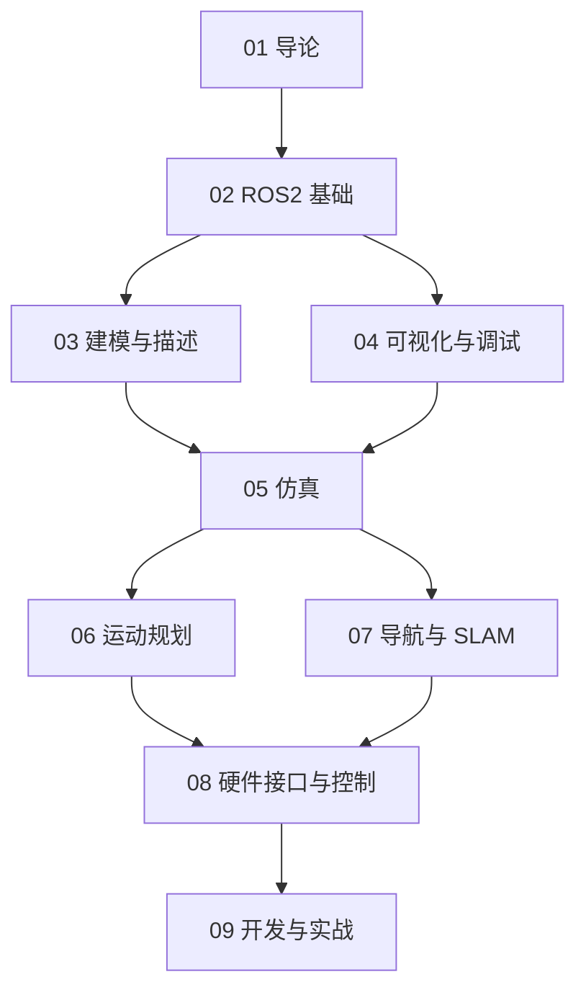

# 机器人软件开发工具知识地图

## 分层学习路线

| 层级 | 技能 | 对应章节 |
|:--:|------|:--:|
| L1 | 理解工具链与 ROS2 发行版 | 01 |
| L2 | ROS2 基础、建模、可视化 | 02–04 |
| L3 | 仿真、运动规划、导航 SLAM | 05–07 |
| L4 | 硬件控制、开发实战 | 08–09 |

## 三条主线

| 主线 | 内容 |
|------|------|
| **通信线** | ROS2 → DDS → 节点/话题/服务 |
| **建模线** | URDF → tf2 → Gazebo → MoveIt |
| **控制线** | Nav2 → ros2_control → micro-ROS |

## 关联

[[007.52-004.4-Robotics-Software-Tools]] · [[3 Resources/6-Technology/raw/articles/007.52-004.4-Robotics-Software-Tools/wiki/index|Wiki 索引]] · [[3 Resources/6-Technology/raw/articles/007.52-004.4-Robotics-Software-Tools/99-资源收集/资源总览|资源总览]]
