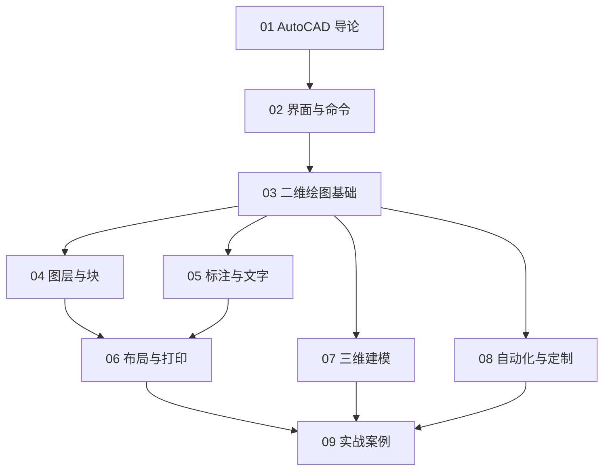

# AutoCAD 知识地图



## 分层学习路线

| 层级 | 技能 | 对应章节 |
|:--:|------|:--:|
| L1 | 认识 AutoCAD、界面、命令行 | 01–02 |
| L2 | 二维绘图/修改命令 | 03 |
| L3 | 图层、块、标注 | 04–05 |
| L4 | 布局出图、三维、自动化 | 06–08 |
| L5 | 完整项目实战 | 09 |

## 核心制图闭环

```
绘图 → 图层组织 → 块复用 → 标注 → 布局出图
```

## 关联

[[604.2-AutoCAD]] · [[3 Resources/People/wiki/index|Wiki 索引]] · [[3 Resources/6-Technology/raw/articles/604.2-AutoCAD-二维制图/99-资源收集/资源总览|资源总览]]
