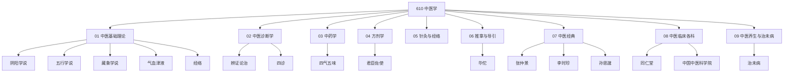

# 中医学知识地图

> 610 中医学知识库全景图。

## 导航

- 入口：[[610-TCM-中医学|610 中医学]]
- 章节：01–09
- 概念：10 个（基础理论、诊断、药性、方剂、养生）
- 实体：6 个（医家与机构）

## 相关

[[3 Resources/6-Technology/raw/articles/610-Medicine-医学健康/610-Medicine-医学健康|610 医学健康]] · [[3 Resources/6-Technology/6-Technology|600 技术]]
