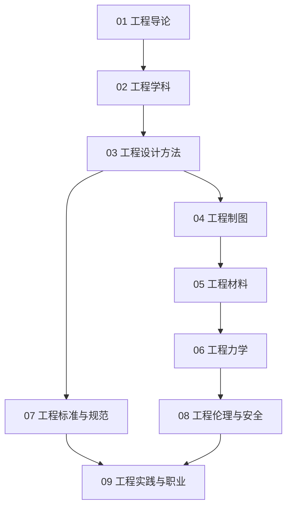

# 工程知识地图

## 分层学习路线

| 层级 | 技能 | 对应章节 |
|:--:|------|:--:|
| L1 | 理解工程定义、方法、历史 | 01 |
| L2 | 工程学科、设计方法 | 02–03 |
| L3 | 制图、材料、力学 | 04–06 |
| L4 | 标准、伦理、职业实践 | 07–09 |

## 三条主线

| 主线 | 内容 |
|------|------|
| **设计线** | 设计方法 → 制图 → 材料 → 力学 |
| **规范线** | 标准 → 规范 → 伦理 → 安全 |
| **职业线** | 学科 → 实践 → 项目管理 |

## 关联

[[62-Engineering-工程]] · [[3 Resources/6-Technology/raw/articles/62-Engineering-工程/wiki/index|Wiki 索引]] · [[3 Resources/6-Technology/raw/articles/62-Engineering-工程/99-资源收集/资源总览|资源总览]]
