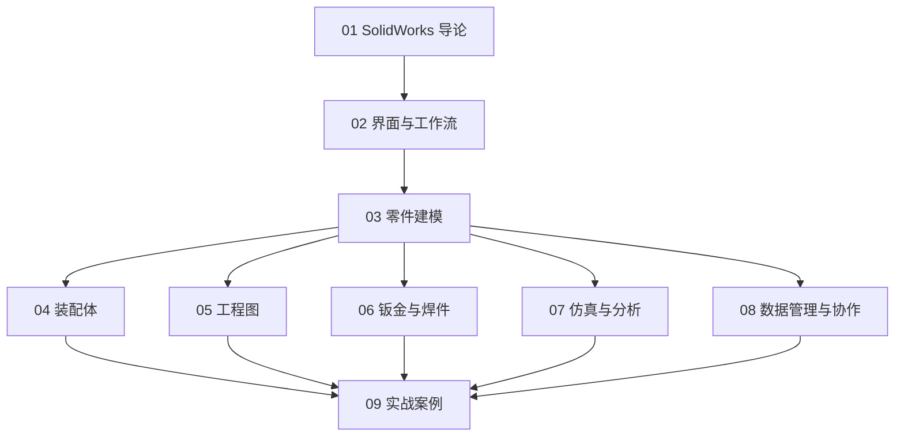

# SolidWorks 知识地图



## 分层学习路线

| 层级 | 技能 | 对应章节 |
|:--:|------|:--:|
| L1 | 认识 SolidWorks、界面、草图绘制 | 01–02 |
| L2 | 零件建模（拉伸/旋转/扫描/放样） | 03 |
| L3 | 装配、工程图、钣金焊件 | 04–06 |
| L4 | 仿真验证、数据管理 | 07–08 |
| L5 | 完整项目实战 | 09 |

## 核心设计闭环

```
草图 → 特征 → 零件 → 装配 → 工程图 → 仿真验证 → 制造
```

## 关联

[[620-SolidWorks-三维 CAD]] · [[3 Resources/People/wiki/index|Wiki 索引]] · [[3 Resources/6-Technology/raw/articles/620-SolidWorks-三维CAD/99-资源收集/资源总览|资源总览]]
