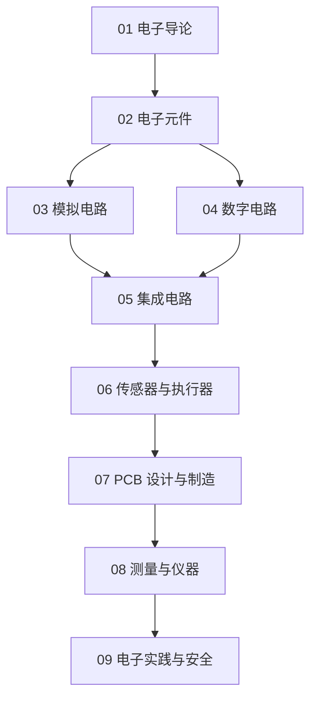

# 电子知识地图

## 分层学习路线

| 层级 | 技能 | 对应章节 |
|:--:|------|:--:|
| L1 | 理解电子定义、欧姆定律 | 01 |
| L2 | 电子元件 | 02 |
| L3 | 模拟/数字电路、集成电路 | 03–05 |
| L4 | 传感器、PCB、测量、实践 | 06–09 |

## 三条主线

| 主线 | 内容 |
|------|------|
| **元件线** | 电阻 → 电容 → 二极管 → 三极管 |
| **电路线** | 模拟 → 数字 → 集成电路 |
| **实践线** | 传感器 → PCB → 测量 → 焊接 |

## 关联

[[621.38-Electronics-电子]] · [[3 Resources/6-Technology/raw/articles/621.38-Electronics-电子/wiki/index|Wiki 索引]] · [[3 Resources/6-Technology/raw/articles/621.38-Electronics-电子/99-资源收集/资源总览|资源总览]]
