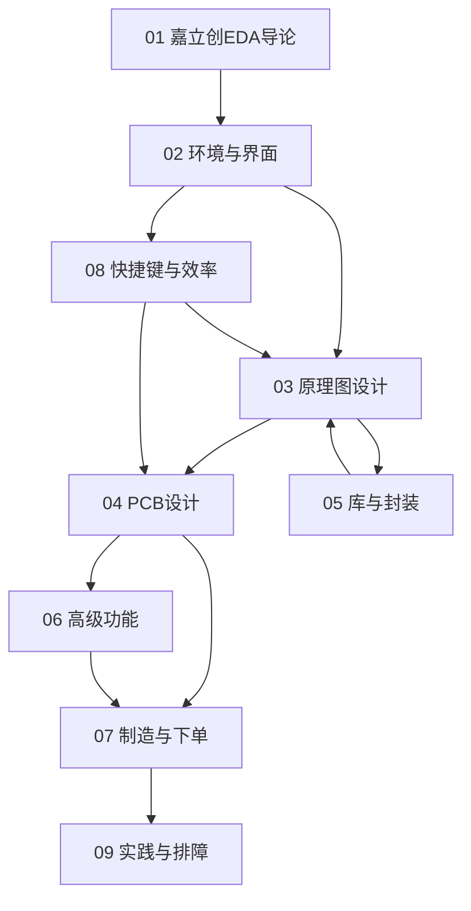

# 嘉立创EDA 知识地图

## 设计流程主线

| 阶段 | 章节 | 产出 |
|:--|:--|:--|
| 原理图 | 03 + 05 | 电路逻辑 + 器件/封装 |
| 转 PCB | 04 | 布局、布线 |
| 制造 | 06 + 07 | Gerber、BOM、下单 |
| 效率与排障 | 08 + 09 | 快捷键、FAQ |

## 三条主线

| 主线 | 内容 |
|------|------|
| **设计线** | 原理图 → 器件/封装 → PCB → 高级功能 |
| **制造线** | Gerber → BOM → SMT → 嘉立创下单 |
| **效率线** | 快捷键 → 排障 → 库管理 |

## 关联

[[621.38-LCEDA-嘉立创EDA]] · [[3 Resources/6-Technology/raw/articles/621.38-LCEDA-嘉立创EDA/wiki/index|Wiki 索引]] · [[99-资源收集]]
