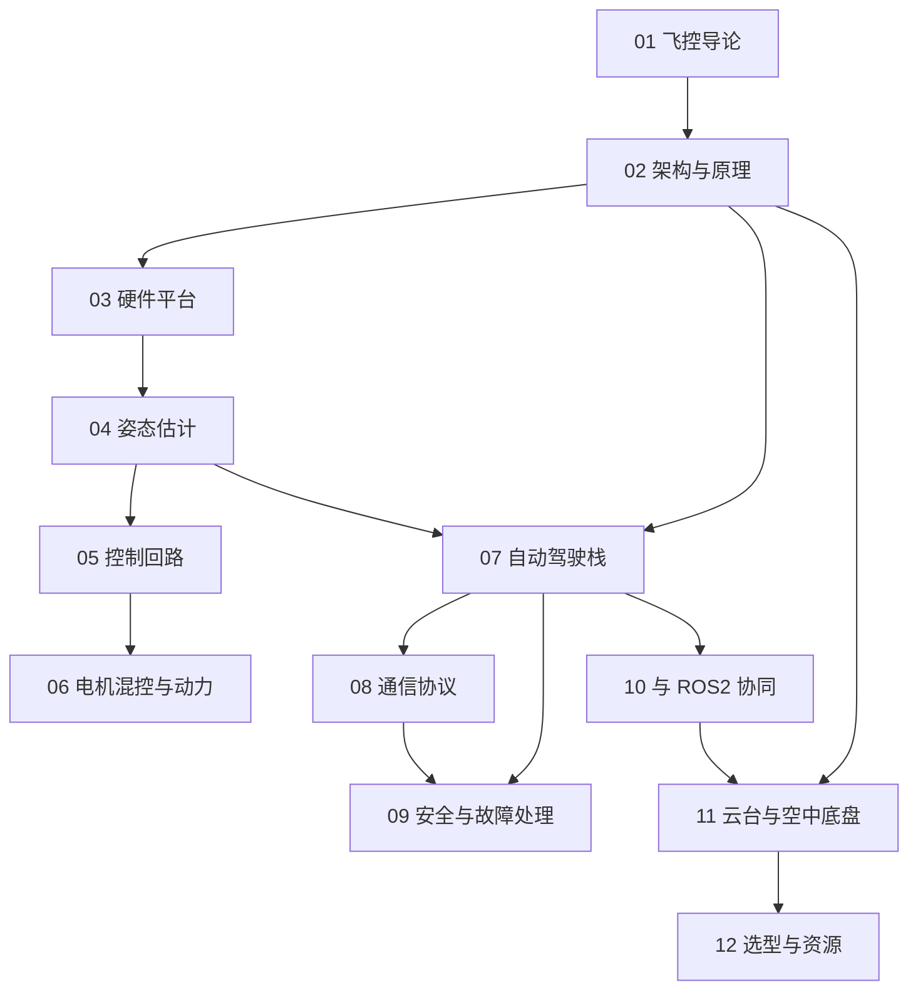

# 飞控知识地图

## 分层学习路线

| 层级 | 技能 | 对应章节 |
|:--:|------|:--:|
| L1 | 理解飞控定位与「飞控 vs 开发板」边界 | 01–02 |
| L2 | 认识硬件平台与传感器 | 03 |
| L3 | 掌握姿态估计与控制回路 | 04–05 |
| L4 | 混控、自动驾驶栈、通信与安全 | 06–09 |
| L5 | ROS 2 协同、云台、选型实战 | 10–12 |

## 三条主线

| 主线 | 内容 |
|------|------|
| **控制线** | IMU → EKF 姿态估计 → PID 级联 → 混控 → ESC |
| **软件线** | PX4(NuttX/uORB) / ArduPilot(ChibiOS) / Betaflight |
| **集成线** | MAVLink → 地面站 / ROS 2 → 空中底盘 / 云台 |

## 关联

[[629.7-FlightControl-飞控]] · [[飞控学习路径|飞控学习路径]] · [[3 Resources/6-Technology/raw/articles/629.7-FlightControl-飞控/wiki/index|Wiki 索引]] · [[12-选型与资源]]
