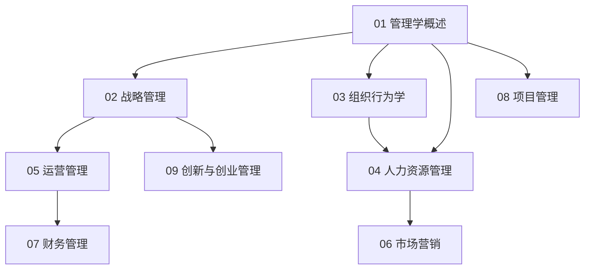

# 管理知识地图

## 分层学习路线

| 层级 | 技能 | 对应章节 |
|:--:|------|:--:|
| L1 | 理解管理职能与理论 | 01 |
| L2 | 战略、组织、人力 | 02–04 |
| L3 | 运营、营销、财务 | 05–07 |
| L4 | 项目、创新与创业 | 08–09 |

## 三条主线

| 主线 | 内容 |
|------|------|
| **职能线** | 计划 → 组织 → 领导 → 控制 |
| **职能管理线** | 战略 → 运营 → 营销 → 财务 → 人力 |
| **实践线** | 项目 → 创新 → 创业 |

## 关联

[[65-Management-管理]] · [[3 Resources/6-Technology/raw/articles/65-Management-管理/wiki/index|Wiki 索引]] · [[3 Resources/6-Technology/raw/articles/65-Management-管理/99-资源收集/资源总览|资源总览]]
