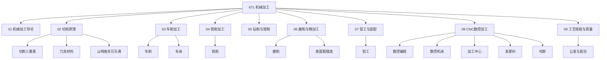

# 机械加工知识地图

> 671 机械加工知识库全景图。

## 导航

- 入口：[[671-Machining-机械加工|671 机械加工]]
- 章节：01–09
- 概念：10 个（切削原理、各工艺、精度质量）
- 实体：6 个（机床与厂商）

## 相关

[[3 Resources/6-Technology/raw/articles/670-Manufacturing-制造业/670-Manufacturing-制造业|670 制造业]] · [[3 Resources/6-Technology/raw/articles/620-Engineering-工程学/620-Engineering-工程学|620 工程学]]
