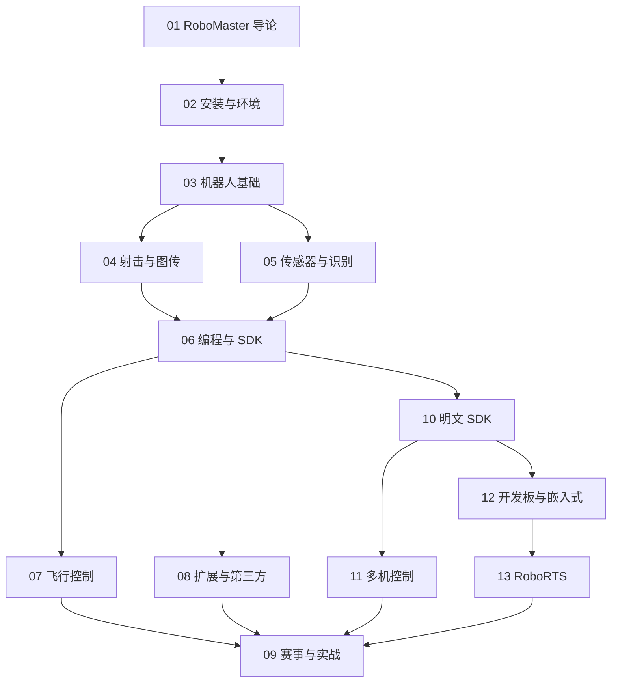

# RoboMaster 知识地图

## 分层学习路线

| 层级 | 技能 | 对应章节 |
|:--:|------|:--:|
| L1 | 理解 RoboMaster 定位与产品线 | 01 |
| L2 | SDK 安装、连接机器人 | 02 |
| L3 | 底盘/云台/射击/图传 | 03–04 |
| L4 | 传感器/识别、SDK 编程 | 05–06 |
| L5 | 明文 SDK、多机、开发板、RoboRTS | 10–13 |
| L6 | 飞行、扩展、赛事实战 | 07–09 |

## 三条主线

| 主线 | 内容 |
|------|------|
| **硬件线** | 底盘 → 云台 → 射击 → 图传 → 传感器 |
| **软件线** | SDK 安装 → Robot 对象 → API → 事件回调 |
| **教育线** | 编程教育 → 扩展 → 赛事 |
| **深度线** | 明文 SDK → 多机编队 → 开发板 → RoboRTS |

## 关联

[[681.5-RoboMaster]] · [[3 Resources/6-Technology/raw/articles/681.5-RoboMaster/wiki/index|Wiki 索引]] · [[3 Resources/6-Technology/raw/articles/681.5-RoboMaster/99-资源收集/资源总览|资源总览]]
