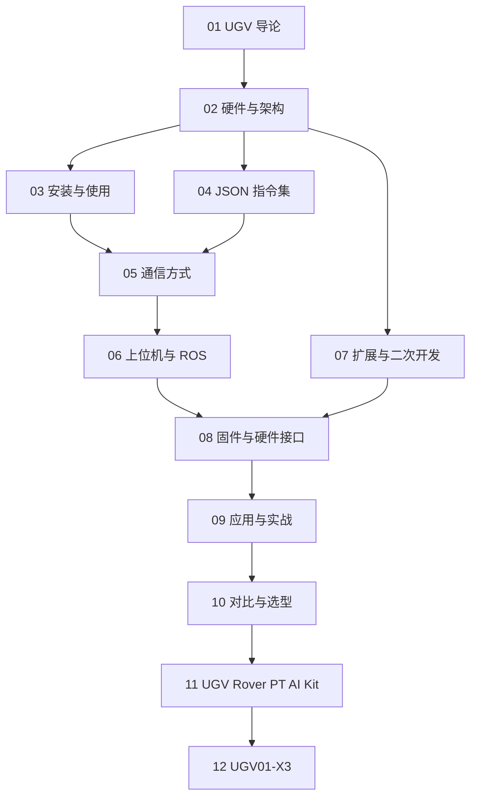

# UGV 知识地图

## 分层学习路线

| 层级 | 技能 | 对应章节 |
|:--:|------|:--:|
| L1 | 理解 UGV 定位与特性 | 01 |
| L2 | 硬件架构、安装使用 | 02–03 |
| L3 | JSON 指令集、通信方式 | 04–05 |
| L4 | 上位机/ROS、扩展开发 | 06–07 |
| L5 | 固件接口、应用实战、选型、AI 套件、X3 | 08–12 |

## 三条主线

| 主线 | 内容 |
|------|------|
| **硬件线** | 底盘 → ESP32 → UPS 供电 → 电机 → 扩展导轨 |
| **通信线** | JSON 指令 → 串口/USB → HTTP → ESP-NOW → Web |
| **软件线** | Arduino → ROS2 → 上位机 → 二次开发 |

## 关联

[[681.5-UGV]] · [[3 Resources/6-Technology/raw/articles/681.5-UGV/wiki/index|Wiki 索引]] · [[3 Resources/6-Technology/raw/articles/681.5-UGV/99-资源收集/资源总览|资源总览]]
