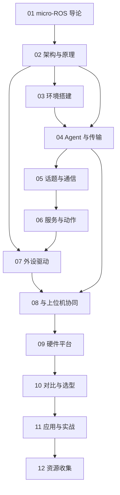

# micro-ROS 知识地图

## 分层学习路线

| 层级 | 技能 | 对应章节 |
|:--:|------|:--:|
| L1 | 理解 micro-ROS 定位与 ROS 2 关系 | 01 |
| L2 | 掌握 Micro XRCE-DDS / client-agent 架构 | 02 |
| L3 | 搭环境、配 Agent 与传输 | 03–04 |
| L4 | 话题/服务/动作、外设驱动 | 05–07 |
| L5 | 上位机协同、选型、实战、资源 | 08–12 |

## 三条主线

| 主线 | 内容 |
|------|------|
| **协议线** | Micro XRCE-DDS → DDS → topic/service/action |
| **链路线** | MCU(client) → Agent → ROS 2 DDS 图 → 上位机 |
| **硬件线** | ESP32-S3 → 电机/编码器/IMU/LiDAR → 上位机(Pi/Jetson) |

## 关联

[[681.5-microROS]] · [[3 Resources/6-Technology/raw/articles/681.5-microROS/wiki/index|Wiki 索引]] · [[学习路径|学习路径]] · [[例程索引|例程集]] · [[12-资源收集]]
