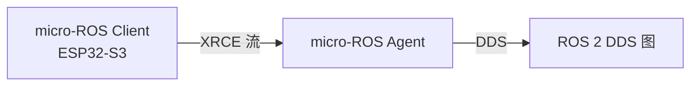

# 02 架构与原理

## Micro XRCE-DDS 协议

[[Micro-XRCE-DDS|Micro XRCE-DDS]]（eXtremely Resource Constrained Environments DDS，由 eProsima 维护）是 micro-ROS 的核心通信协议。它采用 **client-server** 架构：

- **Client** 跑在 MCU 上，是轻量 XRCE 客户端
- **Agent** 跑在上位机/主机上，把 Client 的实体代理进 DDS 图
- 二者通过一条传输流（串口/UDP/TCP）通信，Client 无完整 DDS 栈

## 三层架构（易混淆，务必分清）

| 层 | 是什么 | 关键点 |
|:--|:------|:------|
| ROS 2 | DDS 图（驱动、算法、传感器） | 上位机，常跑 Docker |
| micro-ROS | Client ↔ Agent 的串口通路 | 把 MCU 打进 DDS |
| rosbridge | WebSocket(9090) ROS 2 ↔ JSON | 浏览器/Web 前端 |

## 关键组件

| 组件 | 作用 |
|:----|:-----|
| [[rmw\|rmw_microxrcedds]] | micro-ROS 的 ROS 中间件接口实现 |
| [[rclc\|rclc]] | C 客户端库（rcl + executor），MCU 侧编程接口 |
| [[micro-ROS-Agent\|micro-ROS Agent]] | 桥接进程，把 XRCE 实体代理进 DDS |
| [[Transport-传输\|传输层]] | Serial / UDP / TCP / 自定义 |

## 内存模型

MCU 资源有限，micro-ROS 默认**静态内存**分配（编译期确定类型/队列），避免堆碎片；也支持 dynamic 类型（需更多 RAM）。

## 相关

[[01-micro-ROS导论]] · [[05-话题与通信]] · [[DDS]]

## Sources

[[source-microROS-docs]]
