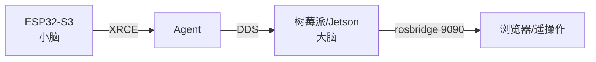

# 08 与上位机协同

## 大小脑架构

[[下位机-MCU|下位机]]（MCU，小脑）负责实时底层（电机/编码器/传感器），上位机（Pi/Jetson，大脑）负责算法/规划/可视化。二者通过 [[micro-ROS-Agent|Agent]] 在 ROS 2 DDS 图上无缝对接。

## 常见部署

| 上位机 | 角色 | 说明 |
|:------|:----|:-----|
| Raspberry Pi 5/4B | 主控 + Agent | 成本低，教育/轻量 |
| Jetson Nano/Orin | 主控 + AI | 视觉/深度学习 |
| RDK（旭日） | 主控 | 国产替代 |

Agent 常跑在 Docker 里，`--net=host` 共享 DDS 网络；上位机同时可跑 rosbridge 提供 Web 遥操作。

## 跨语言前端

rosbridge_suite（WebSocket 9090）把 ROS 2 topic 翻译成 JSON，供浏览器/手机端遥操作——与 micro-ROS 串口链路正交，二者可共存。

## 相关

[[02-架构与原理]] · [[10-对比与选型]] · [[Raspberry-Pi]] · [[Jetson]]

## Sources

[[source-yahboom]] · [[source-microROS-docs]]
