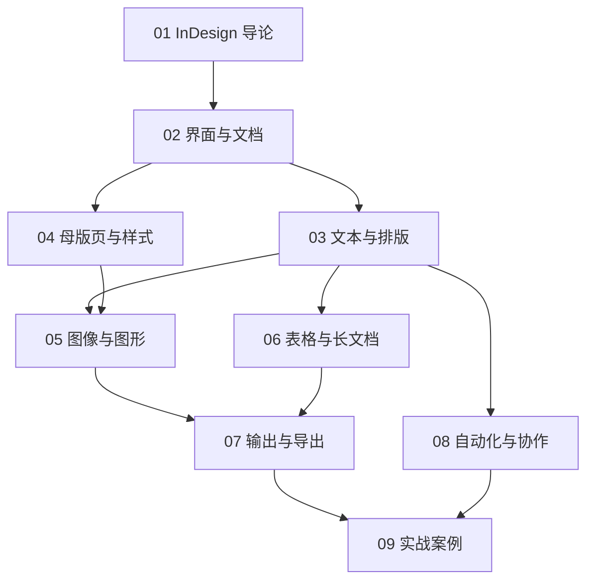

# InDesign 知识地图



## 分层学习路线

| 层级 | 技能 | 对应章节 |
|:--:|------|:--:|
| L1 | 认识 InDesign、文档设置 | 01–02 |
| L2 | 文本排版、母版页、样式 | 03–04 |
| L3 | 图像、表格、长文档 | 05–06 |
| L4 | 输出导出、自动化 | 07–08 |
| L5 | 完整项目实战 | 09 |

## 核心出版闭环

```
版面设计 → 排版 → 样式管理 → 预检 → 输出（打印/数字）
```

## 关联

[[686.2-InDesign]] · [[3 Resources/People/wiki/index|Wiki 索引]] · [[3 Resources/6-Technology/raw/articles/686.2-InDesign-桌面出版/99-资源收集/资源总览|资源总览]]
