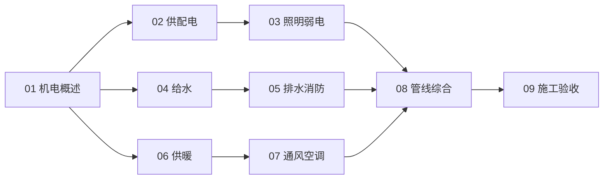

# 建筑机电知识地图

> 建筑机电（MEP）的结构化导航——按「总览 → 电气 → 给排水 → 暖通 → 综合」分层。

## 分层总览

```
建筑机电 MEP (696)
├── 电气（696.3）
│   ├── 供配电（变压器·配电箱·线路）
│   └── 照明与弱电（照明·消防报警·防雷）
├── 给排水（696.1）
│   ├── 给水系统（水压·热水）
│   └── 排水与消防（排水·雨水·消防水）
├── 暖通（697）
│   ├── 供暖系统（散热器·地暖）
│   └── 通风与空调（通风·冷热源）
└── 综合
    ├── 管线综合（BIM 协同）
    └── 施工验收与规范
```

## 学习路线



## 关联

[[696-Building-Services-建筑机电|主索引]] · [[3 Resources/People/wiki/index|Wiki 索引]] · [[3 Resources/6-Technology/raw/articles/681.5-RoboMaster/99-资源收集/资源总览|资源总览]]
