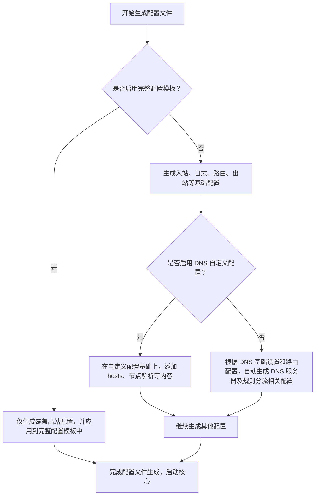

# v2rayN 使用手册

> 基于 [2dust/v2rayN](https://github.com/2dust/v2rayN) 官方 Wiki 整理的中文使用指南
> 适用版本：v7.x

---

## 目录

1. [简介](#一简介)
2. [安装指南](#二安装指南)
3. [快速上手](#三快速上手)
4. [界面功能详解](#四界面功能详解)
5. [路由系统](#五路由系统)
6. [高级功能](#六高级功能)
7. [常见问题](#七常见问题)

---

## 一、简介

### 1.1 什么是 v2rayN

v2rayN 是一个跨平台的网络代理 GUI 客户端，支持 Windows / Linux / macOS 三大桌面操作系统。它底层可接入多种代理核心（Xray、sing-box、mihomo 等），提供统一的图形界面来管理节点、订阅、路由规则和系统代理。

**核心特性：**

- **多核心支持**：Xray-core、v2fly-core、sing-box、mihomo(Clash)、Hysteria2、TUIC 等
- **全协议覆盖**：VMess、VLESS、Trojan、Shadowsocks、SOCKS、Hysteria2、TUIC、WireGuard 等
- **灵活的订阅系统**：多地址合并、别名过滤、订阅转换
- **强大的路由引擎**：域名/IP/进程分流、策略组、自定义规则
- **DNS 进阶功能**：FakeIP、并行查询、乐观缓存、hosts 映射
- **安全特性**：证书固定、TLS 指纹伪装、Mux 多路复用
- **跨平台**：Windows（WPF / Avalonia UI）、Linux、macOS

### 1.2 沟通与支持

| 渠道 | 用途 |
|------|------|
| [GitHub Discussions](https://github.com/2dust/v2rayN/discussions) | 提问与讨论 |
| [GitHub Issues](https://github.com/2dust/v2rayN/issues/new) | 报告 Bug 或功能请求 |
| [GitHub Wiki](https://github.com/2dust/v2rayN/wiki) | 官方文档 |
| [Pull Request](https://github.com/2dust/v2rayN/compare) | 贡献代码 |

---

## 二、安装指南

### 2.1 发布文件说明（v7.x）

所有发布包均可在 [GitHub Releases](https://github.com/2dust/v2rayN/releases) 下载。`zip` 格式为**便携版**，解压即用，存储文件在本文件夹内；可复制多份独立运行（修改监听端口即可多开）。

发布包中已内置部分 Core 文件（Xray、sing-box、mihomo），其余 Core 需自行下载放入 `bin/` 文件夹。

### 2.2 Windows 安装

**系统要求：** Windows 10+

| 架构 | 包名 | 说明 |
|------|------|------|
| x64 | `v2rayN-windows-64.zip` | WPF 界面（推荐） |
| x64 | `v2rayN-windows-64-desktop.zip` | Avalonia UI 界面 |
| arm64 | `v2rayN-windows-arm64.zip` | WPF 界面 |
| arm64 | `v2rayN-windows-arm64-desktop.zip` | Avalonia UI 界面 |

其他 Core 可从 [这里](https://github.com/2dust/v2rayN-core-bin/blob/master/v2rayN-windows-64-other-bins.zip) 下载后放入 `bin/` 文件夹。

### 2.3 Linux 安装

**支持发行版：** Debian 12+ / Ubuntu 22.04+ / Fedora 36+ / Redhat 9+

| 架构 | 包类型 | 安装命令 |
|------|--------|----------|
| x64 | zip | `chmod +x v2rayN && ./v2rayN` |
| x64 | deb | `sudo apt install -y ./v2rayN-linux-64.deb` |
| x64 | rpm | `sudo dnf install -y ./v2rayN-linux-rhel-x64.rpm` |
| arm64 | zip | `chmod +x v2rayN && ./v2rayN` |
| arm64 | deb | `sudo apt install -y ./v2rayN-linux-arm64.deb` |
| arm64 | rpm | `sudo dnf install -y ./v2rayN-linux-rhel-arm64.rpm` |

非 zip 包为安装版，存储文件位置为系统规定的用户文件目录。

### 2.4 macOS 安装

**系统要求：** macOS 12+

| 架构 | 包类型 | 说明 |
|------|--------|------|
| x64 | zip | `chmod +x v2rayN && ./v2rayN` |
| x64 | dmg | 需运行 `xattr -cr /Applications/v2rayN.app`（绕过未签名提示） |
| arm64 | zip | `chmod +x v2rayN && ./v2rayN` |
| arm64 | dmg | 需运行 `xattr -cr /Applications/v2rayN.app` |

> ⚠️ dmg 安装包没有签名，macOS 会提示"应用已损坏"，这是正常的，按上述命令修复即可。

### 2.5 支持的核心列表

| 系列 | 核心 | 下载地址 |
|------|------|----------|
| V2Ray | Xray-core | [GitHub](https://github.com/XTLS/Xray-core/releases) |
| V2Ray | v2fly-core | [GitHub](https://github.com/v2fly/v2ray-core/releases) |
| Clash | mihomo-core | [GitHub](https://github.com/MetaCubeX/mihomo/releases) |
| sing-box | sing-box-core | [GitHub](https://github.com/SagerNet/sing-box/releases) |
| 其他 | Hysteria2 | [GitHub](https://github.com/apernet/hysteria/releases) |
| 其他 | naiveproxy | [GitHub](https://github.com/klzgrad/naiveproxy/releases) |
| 其他 | tuic | [GitHub](https://github.com/EAimTY/tuic/releases) |
| 其他 | juicity | [GitHub](https://github.com/juicity/juicity/releases) |
| 其他 | brook | [GitHub](https://github.com/txthinking/brook/releases) |
| 其他 | overtls | [GitHub](https://github.com/ShadowsocksR-Live/overtls/releases) |
| 其他 | shadowquic | [GitHub](https://github.com/spongebob888/shadowquic) |

**GEO 数据来源：**
- [Loyalsoldier/v2ray-rules-dat](https://github.com/Loyalsoldier/v2ray-rules-dat)
- [2dust/sing-box-rules](https://github.com/2dust/sing-box-rules)

---

## 三、快速上手

### 3.1 添加订阅节点

1. 从服务商处获取**订阅链接 URL**
2. 打开 v2rayN → **订阅分组** → **订阅分组设置**
3. 点击"新增"，在"可选地址"中填入订阅 URL
4. 填写别名（如"我的机场"），点击确定
5. 右键分组 → **更新订阅**（或不通过代理更新订阅）

系统会自动下载、解析并添加所有节点。

### 3.2 手动添加节点

**方式一：从剪贴板导入（推荐）**

复制分享链接（如 `vmess://...`、`vless://...`、`ss://...`），在 v2rayN 主界面**非输入框区域**按 `Ctrl+V`。

系统会自动识别并解析以下格式：
- BASE64 编码内容
- SIP008（Shadowsocks）
- sing-box / v2ray 自定义配置（多/单配置）
- Clash / Hysteria 自定义配置
- HTTPS 开头的订阅链接

**方式二：分组内新增**

右键分组 → 新增 → 选择协议类型，手动填写服务器参数。

### 3.3 开启代理

1. 在配置文件列表中**双击**一个节点（或右键 → 设为活动服务器）
2. 右键系统托盘图标 → **自动配置系统代理**（图标变红即成功）
3. 浏览器即可访问国际网络

> 💡 推荐搭配：系统代理选择**自动配置系统代理**，路由选择**绕过大陆**。这是最适合普通用户的组合。

### 3.4 路由模式选择

| 模式 | 说明 | 适用场景 |
|------|------|----------|
| 绕过大陆 | 国内流量直连，国外流量走代理（推荐） | 日常使用 |
| 全局 | 所有流量走代理 | 需要固定 IP 的场景 |
| 黑名单 | 仅规则中的网站走代理 | 精细控制 |
| 白名单 | 仅规则中的网站直连 | 特殊需求 |

---

## 四、界面功能详解

### 4.1 主界面

**配置文件列表：**
- 点击列标题可按此列排序（延迟和速度列排序特殊：无效数据永久排在最后）
- 拖动列可改变顺序和宽度，正常退出后自动保存布局
- 配置文件过滤为模糊查询，不支持正则表达式

**信息栏：**
- 显示核心运行日志
- 支持正则表达式过滤
- 过滤器只对之后产生的数据生效

### 4.2 订阅分组管理

**可选地址与更多地址：**

| 场景 | 配置方式 |
|------|----------|
| 每个订阅地址独立分组 | 仅填写"可选地址" |
| 多个地址合并到一个分组 | "可选地址" + "更多地址"（逗号分隔） |

当"更多地址"有数据时，订阅转换功能将失效。地址中的订阅类型需一致，更新时将依次下载每个地址的内容后合并解析。

**别名正则过滤：**
更新订阅解析后，检查每个配置的别名是否匹配正则表达式，符合条件的保留。可用于排除特定节点（需学习正则表达式）。目前仅支持 v2rayN 订阅内容的过滤。

**订阅转换目标类型：**

启用后，更新订阅时会调用订阅转换服务，将内容转换后再解析。

**User Agent：**

部分订阅后台服务根据 UA 决定返回内容。v2rayN 默认发送 `v2rayN/版本号`。如有特殊需求可手动修改。

**前置代理别名 / 落地代理别名：**
详见"前置代理与落地代理"章节。

### 4.3 基础设置

**本地混合监听端口：**
```
端口号分配规则：
  N     = 本地混合监听端口（同时监听 SOCKS5 + HTTP）
  N+1   = 第二个本地监听端口
  N+2   = 局域网端口
  N+3   = PAC 端口
  N+4   = Xray API 端口
  N+5   = mihomo API 端口
  N+21  = 测试临时配置端口
```

**开启 Mux 多路复用：**
启用后仅 VLESS、VMess、Shadowsocks、Trojan 协议有效。更多参数见 `guiNConfig.json`。sing-box 需额外选择多路复用协议。

**启用日志存到文件：**
开启后核心日志存储到 `guiLogs/` 文件夹，否则直接显示在主界面信息栏。

**默认跳过证书验证：**
导入分享链接和更新订阅时，配置文件的默认值从此设置获取。如需批量修改，建议删除分组中所有配置，设置好默认值后重新更新订阅。

**启用分片：**
Xray 分片实现类似代理链，开启后前置代理和落地代理将失效。

### 4.4 v2rayN 设置

| 设置项 | 说明 |
|--------|------|
| 开机启动 | 以管理员权限设置，启动后可获得管理员权限（TUN 模式需要） |
| 自动更新 Geo 文件间隔 | 设为 0 禁用自动更新 |
| 托盘菜单配置文件数量限制 | 超过限制时，切换配置文件选项自动隐藏 |
| 测试时自动分批每批数量 | 默认 1000，分批可提高成功率和降低资源占用 |

### 4.5 代理配置

**例外地址：**
对于列表中的地址不使用系统代理。使用逗号(,)分隔。有默认值，不可为空（为空会自动填充默认值）。

**高级代理设置 - 协议选择（可选）：**
Windows 下特殊应用需设置系统代理协议。普通用户**不要设置**此选项。

### 4.6 TUN 模式设置

**启用额外监听端口：**
普通使用时流量从 TUN 入口进入，配置文件中无其他入口。若需同时存在 Mixed 入口，开启此选项。

> ⚠️ TUN 模式问题较为复杂，遇问题请参考：
> - [Issue #4539](https://github.com/2dust/v2rayN/issues/4539)
> - [Discussion #3888](https://github.com/2dust/v2rayN/discussions/3888)
> - [Discussion #5828](https://github.com/2dust/v2rayN/discussions/5828)

### 4.7 Core 类型设置

启动 Core 时，优先使用当前配置中的 Core 类型；为空时再检查"Core 类型设置"中的默认值。

---

## 五、路由系统

### 5.1 系统代理模式

v2rayN 提供四种系统代理模式：

| 模式 | 行为 |
|------|------|
| 清除系统代理 | 每次启动/重启服务时，清除操作系统的代理设置 |
| 自动配置系统代理 | 每次启动/重启服务时，自动设定系统代理，转发流量给核心（**推荐**） |
| 不改变系统代理 | 保留其他软件设定的代理 |
| PAC 模式 | Windows 专用，使用 PAC 脚本：Direct 走本地，PROXY 转发给核心 |

**核心路由功能：**
将入站数据按规则由不同出站连接发出，实现分流。最常用的是分流国内外流量：国内直连、国外代理。

**推荐用法：** 自动配置系统代理 + 绕过大陆

### 5.2 路由规则管理

**一键导入规则集：**
初次使用无需操作，v2rayN 初始已生成默认规则集。当开发者提醒默认规则集有更新时，可使用此功能（不会删除修改原有规则集，仅新增）。

**域名解析策略：**
与规则集强关联。初始值和初始规则集适合普通用户，修改前请仔细阅读官方文档。

**规则列表：**
路由按规则的先后顺序匹配，匹配到前面的规则后，后面的不再生效。添加新规则后请记得调整顺序。

**路由规则详情设置：**
```
匹配逻辑：(Domain 或 IP 或 进程名) 与 Port 与 Protocol 与 InboundTag 与 network
→ OutboundTag
```
每条规则中的 Domain / IP / 进程名三项请只填写一项，即使全填了 v2rayN 也会自动拆成多条规则。

### 5.3 自定义路由规则

以 JSON 数组格式定义规则，每条规则包含：

| 字段 | 说明 |
|------|------|
| `port` | 端口号或范围（如 `"443"`、`"0-65535"`） |
| `network` | 网络协议（`tcp` / `udp`） |
| `outboundTag` | 出站标签（`proxy` / `direct` / `block`） |
| `domain` | 域名列表（支持 `geosite:` 前缀） |
| `ip` | IP 列表（支持 `geoip:` 前缀） |
| `enabled` | 是否启用 |
| `remarks` | 备注说明 |

**内置示例规则：**
```json
[
  { "port": "443", "network": "udp", "outboundTag": "block", "enabled": true, "remarks": "阻断udp443" },
  { "outboundTag": "block", "domain": ["geosite:category-ads-all"], "enabled": true, "remarks": "阻断广告" },
  { "outboundTag": "direct", "ip": ["geoip:private"], "enabled": true, "remarks": "绕过局域网IP" },
  { "outboundTag": "direct", "domain": ["geosite:private"], "enabled": true, "remarks": "绕过局域网域名" },
  { "port": "0-65535", "outboundTag": "proxy", "enabled": true, "remarks": "最终代理" }
]
```

参考文档：
- [Xray 路由规则官方文档](https://xtls.github.io/config/routing.html#ruleobject)
- [自定义路由规则示例](https://raw.githubusercontent.com/2dust/v2rayCustomRoutingList/master/custom_routing_rules)

### 5.4 DNS 设置

#### 5.4.1 DNS 基础设置

| 字段 | 说明 |
|------|------|
| **直连 DNS** | 直连 DNS 服务器地址，多个用逗号隔开。Xray 中默认仅用于路由阶段 IP 规则匹配解析；sing-box 中负责路由匹配解析、节点域名解析和直连目标域名解析 |
| **远程 DNS** | 远程 DNS 服务器地址，多个用逗号隔开。Xray 中默认仅用于路由匹配解析；sing-box 中负责路由匹配解析和代理目标域名解析 |
| **Bootstrap DNS** | 必须为 IP 地址形式。当直连/远程 DNS 使用域名地址时，用于解析这些 DNS 域名 |

**解析策略：**

| 策略 | 说明 |
|------|------|
| 直连目标解析策略 | 出站时直连目标的域名解析。未设置或 `AsIs` 时使用系统 DNS，否则用直连 DNS |
| 代理目标解析策略 | 出站时代理目标的域名解析。`AsIs` 时代理节点自行处理，否则用远程 DNS |

**高级选项：**

| 选项 | 说明 |
|------|------|
| 并行查询 | DNS 回退默认串行。启用后异步并发查询，"动态分组，组内竞速，组间回退"（仅 Xray） |
| 乐观缓存 | 缓存过期后仍继续使用直到新查询返回，减少延迟（仅 Xray） |
| 使用系统 hosts | 将系统 hosts 文件内容加入 DNS hosts（Windows 路径：`C:\Windows\System32\drivers\etc\hosts`） |
| 添加常用 DNS Hosts | 添加 dns.google、cloudflare-dns.com 等映射，增强 Bootstrap 容错 |
| FakeIP | DNS 解析结果映射为特定范围 IP，实现域名劫持和分流（仅 sing-box + TUN 模式） |
| 阻止 SVCB 和 HTTPS 查询 | 屏蔽 ECH 和 HTTP/3 可用性查询，防止域名分流失效（仅 sing-box + TUN） |
| 校验相应地区域名 IP | 如 geoip:cn 对应 geosite:cn，校验解析结果符合中国 IP 范围 |

**DNS Hosts 格式：**
```
example.com 1.2.3.4 5.6.7.8
example.org 2.3.4.5 6.7.8.9
```

#### 5.4.2 自定义 DNS

v2rayN 支持 Xray 和 sing-box 两个内核的 DNS 配置。无特殊要求时，点击"导入默认 DNS 配置"即可。进阶设置请参考官方文档和 GitHub 讨论。

**附加设置：**
- **Outbound 域名解析地址**：设置本机解析 Outbound 域名的地址
- **Outbound 域名解析策略**：对域名解析结果的处理（IPv4 / IPv6 等）

### 5.5 策略组

支持 Xray 和 sing-box 两个内核：

| 内核 | 支持类型 |
|------|----------|
| Xray | 最稳定、最低延迟、负载均衡、随机 |
| sing-box | 最低延迟 |

**添加策略组的两种方式：**

1. **子配置项一** — 从现有分组订阅中，按别名正则筛选（更新订阅时自动刷新）
2. **子配置项二** — 从现有节点中手动选择

两者可同时使用，最终策略组包含所有配置文件。

> ⚠️ 注意：
> - 若在子配置项二中手动包含来自订阅的节点，更新订阅时这些节点会被自动移除
> - 策略组支持嵌套：可在子配置项二中添加其他策略组作为子项
> - Xray 内核策略组中的所有配置必须被 Xray 支持，sing-box 同理
> - 使用 sing-box 时，用户可在当前代理页面的 Selector 组中手工选择出口
> - 链式代理不支持嵌套其他链式代理或策略组

### 5.6 前置代理与落地代理

**前置代理（入口代理）：**
```
数据流向：你的应用 → 前置代理服务器 → 运行的服务器 → 目标地址
```
**使用场景：** 公司内存在 HTTP 代理时，可先建立一个 HTTP 配置，然后在订阅分组中设置前置代理别名为此配置别名。

**落地代理（出口代理）：**
```
数据流向：你的应用 → 运行的服务器 → 落地代理服务器 → 目标地址
```
**使用场景：** 购买了服务但需要落地 IP 不变，可在订阅分组中设置落地代理为自己的服务器。

**通用提示：**
- 支持 Xray-core 和 sing-box-core
- 订阅分组中的节点使用 Xray-core 时，前置/落地代理不支持 Hysteria 2、TUIC、Anytls
- 代理别名不存在时，生成配置时会跳过，且运行时不提示
- 代理别名会在所有配置文件中搜索，建议单独建一个分组存放前置/落地代理配置，防止误删

---

## 六、高级功能

### 6.1 分享链接格式

#### VMess 分享链接

```
vmess://(Base64 编码的 JSON 格式配置文件数据)
```

JSON 字段说明：

| 字段 | 说明 |
|------|------|
| `v` | 配置文件版本号 |
| `ps` | 备注或别名 |
| `add` | 地址 IP 或域名 |
| `port` | 端口号 |
| `id` | UUID |
| `aid` | alterId |
| `scy` | 加密方式（security），默认 auto |
| `net` | 传输协议（tcp / kcp / ws / h2 / quic） |
| `type` | 伪装类型（none / http / srtp / utp / wechat-video），适用于 tcp/kcp/QUIC |
| `host` | 伪装域名：http(tcp)用逗号分隔、ws / h2 直接填、QUIC 表示 security |
| `path` | 路径：ws 用 path、h2 用 path、QUIC 用 key / kcp 用 seed、grpc 用 serviceName |
| `tls` | 传输层安全（tls） |
| `sni` | serverName |
| `alpn` | 如 `h2,http/1.1` |
| `fp` | fingerprint |

#### VLESS 分享链接

参考 [VMessAEAD / VLESS 分享链接标准提案](https://github.com/XTLS/Xray-core/discussions/716)

### 6.2 订阅功能说明

**订阅地址：** 普通可正常访问的 URL
**返回内容格式（BASE64 编码）：**
```
vmess://base64(Configuration)
ss://base64(Configuration)
socks://base64(Configuration)
```

**支持协议：** VMess / Shadowsocks / SOCKS / VLESS / Trojan / Hysteria2 / TUIC / WireGuard / Anytls

### 6.3 证书固定

用于 TLS 协议时固定服务器证书，防止中间人攻击。固定后仅使用此证书验证，忽略系统和核心的证书信任链。

**两种固定方式：**

1. **证书指纹（SHA-256）**
   - 填写证书的 SHA-256 指纹值
   - 多个值用波浪线 `~` 隔开
   - 仅支持 Xray 内核

2. **完整证书（链），PEM 格式**
   - 填写完整的服务器证书内容
   - 可包含多个证书

**获取证书 / 获取证书链：**
v2rayN 会连接服务器获取证书。可能失败的原因：
- 服务器地址无法访问
- 服务器使用自签证书
- 服务器使用不受信任的 CA 或系统内有恶意 CA 证书

v2rayN 内置 Mozilla 根证书列表，并会验证获取到的证书链是否可信任。

### 6.4 完整配置模板

启用后，先正常生成配置文件，再根据模板覆写。v2rayN 会尽可能避免覆写用户已精心设计好的配置。

| 选项 | 说明 |
|------|------|
| 不添加非代理协议出站 | 不自动添加 freedom、direct、block 等出站配置，需用户自行添加 |
| 设置上游代理 tag | 将前置代理为空的节点的 tag 设为上游代理 tag（如公司 HTTP 代理场景），需用户自行添加相应配置 |

### 6.5 隐藏参数（guiNConfig.json）

位置：`v2rayN/guiConfigs/guiNConfig.json`
**修改前请退出 App，修改保存后再运行。**

| 参数 | 说明 |
|------|------|
| `KcpItem` | Xray-core KCP 参数，[文档](https://xtls.github.io/config/transports/mkcp.html) |
| `GrpcItem` | Xray-core gRPC 参数，[文档](https://xtls.github.io/config/transports/grpc.html) |
| `MainColumnItem` | 配置文件列表列属性（`Name` 列名 / `Width` 宽度，-1 隐藏 / `Index` 顺序） |
| `Mux4RayItem` | Xray-core Mux 参数，[文档](https://xtls.github.io/config/outbound.html#muxobject) |
| `Mux4SboxItem` | sing-box Mux 参数，[文档](https://sing-box.sagernet.org/zh/configuration/shared/multiplex/) |
| `Fragment4RayItem` | Xray-core 分片参数，[文档](https://xtls.github.io/config/outbounds/freedom.html) |
| `GuiItem -> EnableLog` | 日志开关，默认 `true`，可改为 `false` |
| `ClashUIItem -> EnableMixinContent` | Clash Mixin 功能开关，默认 `false` |
| `HysteriaItem -> HopInterval` | 端口跳跃间隔（秒） |
| `SpeedTestItem -> SpeedTestPageSize` | 测速每批数量，默认 1000 |
| `SpeedTestItem -> SpeedTestDelayInterval` | 测速批次间隔（秒），默认 1 |

**其他文件说明：**

| 文件 | 说明 |
|------|------|
| `guiNDB.db` | 配置文件等大数据存储，请勿修改 |
| `pac.txt` | Windows 系统代理脚本，可修改（先 Google 文档格式） |
| `Mixin.yaml` | mihomo 的 Mixin 文件 |
| GUID 命名的文件 | 自定义配置文件，请从 App 内打开编辑 |

### 6.6 配置文件生成流程



### 6.7 备份与还原

备份和还原的对象是整个 `guiConfigs/` 文件夹。
- 非 Windows 系统备份时，文件扩展名须为 `.zip`
- 还原时只能选择 zip 文件
- 还原成功后 v2rayN 会自动重启，若重启失败可手动重启

### 6.8 检查更新

从 GitHub 下载更新时会强制通过代理进行。更新失败可尝试更换活动配置文件。

> ⚠️ GitHub API 有调用频率限制，短时间内多次更新可能被限，等几小时或更换配置文件后重试。
> 更新过程中弹出窗口可关闭，进程在后台运行。非 Windows 系统可能看不到进度，请等待约 30 秒。

### 6.9 解除 Win10 UWP 应用回环代理限制

Windows 10+ 的 UWP 应用存在沙盒机制，默认无法访问 localhost（回环地址），因此无法通过本机代理上网。使用此功能可解除限制。

### 6.10 自定义托盘图标

在存储文件夹中放入图标文件 `NotifyIcon1.ico` ~ `NotifyIcon4.ico`，即可自定义托盘图标。图标会随系统代理状态改变而切换。

### 6.11 区域预置设置

v2rayN 默认的 Geo 文件来源 / ruleset 文件来源 / 路由规则集来源等适合中国区域用户。其他区域用户需先设置后再更新为合适的来源。

---

## 七、常见问题

### 7.1 日志在哪里找？

反馈问题前，先删除旧日志，重现问题后提交详细步骤和日志。

| 问题类型 | 日志位置 |
|----------|----------|
| v2rayN 问题（界面、测速、更新等） | `guiLogs/` 文件夹 |
| 核心问题 | 主界面信息栏（可复制） |

### 7.2 如何多开代理？

`zip` 便携版解压多份，分别修改本地监听端口后即可同时运行。

### 7.3 Windows 7 兼容？

v2rayN 依赖 .NET 8，请参考 [微软官方文档](https://learn.microsoft.com/zh-cn/dotnet/core/install/windows)。
各核心对 Win7 有特殊版本：
- **Xray**：下载文件中包含 win7 包
- **sing-box**：下载文件中包含 Windows legacy 包
- **mihomo**：下载文件中包含 Windows go120 包

### 7.4 为什么系统代理只有 HTTP 没有 SOCKS？

Windows 系统代理正常只能配置 HTTP 代理，不支持 SOCKS5 代理（但支持 SOCKS4）。
参考：[讨论区](https://github.com/2dust/v2rayN/discussions/1553)

### 7.5 macOS 无法自动添加代理地址？

v2rayN macOS 版通过脚本实现自动配置系统代理。失败时可查看 `guiLogs/` 日志。
参考：[Issue #6462](https://github.com/2dust/v2rayN/issues/6462)

### 7.6 能否共享热点给其他设备？

可以。在设置中开启"允许来自局域网的连接"，核对端口号，设置好系统防火墙入站规则，在同局域网设备上配置代理参数即可。

### 7.7 PAC 模式和自动配置系统代理的区别？

- PAC 模式：使用 PAC 脚本，根据规则决定直连或走代理（仅 Windows）
- 自动配置系统代理：直接设定系统代理，所有流量经核心后由路由规则分流

详细讨论请参考：[Discussion #3240](https://github.com/2dust/v2rayN/discussions/3240)

### 7.8 运行 Core 失败？

通常在延迟测试、测速或启动活动配置文件时出现。请执行以下步骤：

1. 将日志等级设为 Debug
2. 复制运行 Core 失败时的界面日志
3. 检查：配置错误、Core 版本不兼容、本地端口被占用（如虚拟机）

搜索相关 Issue：[Hyper-V 端口占用](https://github.com/2dust/v2rayN/issues?q=Hyper)
统一反馈：[Issue #6428](https://github.com/2dust/v2rayN/issues/6428)

### 7.9 能代理游戏吗？

可以代理，但不能加速游戏，且可能需要折腾路由规则。建议购买专业游戏加速器。

### 7.10 文件夹路径可以用中文和空格吗？

理论上可以，但为防止异常，建议只使用纯英文字符并移除空格。尽量不要放入有权限限制的目录（如 Windows 的 C 盘）。

### 7.11 不关闭系统代理直接关机，重启后系统代理是什么状态？

大概率是关闭的。v2rayN 会接收系统关机事件并关闭系统代理，但不保证一定执行成功。

---

## 附录：相关链接

| 资源 | 链接 |
|------|------|
| v2rayN 主仓库 | https://github.com/2dust/v2rayN |
| v2rayN Releases | https://github.com/2dust/v2rayN/releases |
| 官方 Wiki | https://github.com/2dust/v2rayN/wiki |
| Xray-core | https://github.com/XTLS/Xray-core |
| sing-box | https://github.com/SagerNet/sing-box |
| mihomo (Clash Meta) | https://github.com/MetaCubeX/mihomo |
| Hysteria2 | https://github.com/apernet/hysteria |
| 自定义路由规则 | https://github.com/2dust/v2rayCustomRoutingList |
| sing-box 规则集 | https://github.com/2dust/sing-box-rules |
| Xray 官方文档 | https://xtls.github.io |
| sing-box 官方文档 | https://sing-box.sagernet.org |
