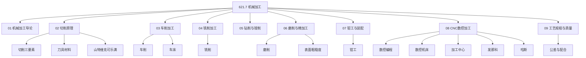

# 机械加工知识地图

> 621.7 机械加工知识库全景图。

```mermaid
graph TD
    Hub["621.7 机械加工"] --> C01["01 机械加工导论"]
    Hub --> C02["02 切削原理"]
    Hub --> C03["03 车削加工"]
    Hub --> C04["04 铣削加工"]
    Hub --> C05["05 钻削与镗削"]
    Hub --> C06["06 磨削与精加工"]
    Hub --> C07["07 钳工与装配"]
    Hub --> C08["08 CNC数控加工"]
    Hub --> C09["09 工艺规程与质量"]

    C02 --> K1["切削三要素"]
    C02 --> K2["刀具材料"]
    C03 --> K3["车削"]
    C04 --> K4["铣削"]
    C06 --> K5["磨削"]
    C06 --> K6["表面粗糙度"]
    C07 --> K7["钳工"]
    C08 --> K8["数控编程"]
    C09 --> K9["公差与配合"]

    C03 --> E1["车床"]
    C08 --> E2["数控机床"]
    C08 --> E3["加工中心"]
    C08 --> E4["发那科"]
    C08 --> E5["哈斯"]
    C02 --> E6["山特维克可乐满"]
```

## 导航

- 入口：[[621.7-机械加工|621.7 机械加工]]
- 章节：01–09
- 概念：10 个（切削原理、各工艺、精度质量）
- 实体：6 个（机床与厂商）

## 相关

[[67-各种工业|67 各种工业]] · [[10-学科分支|620 工程学]]
