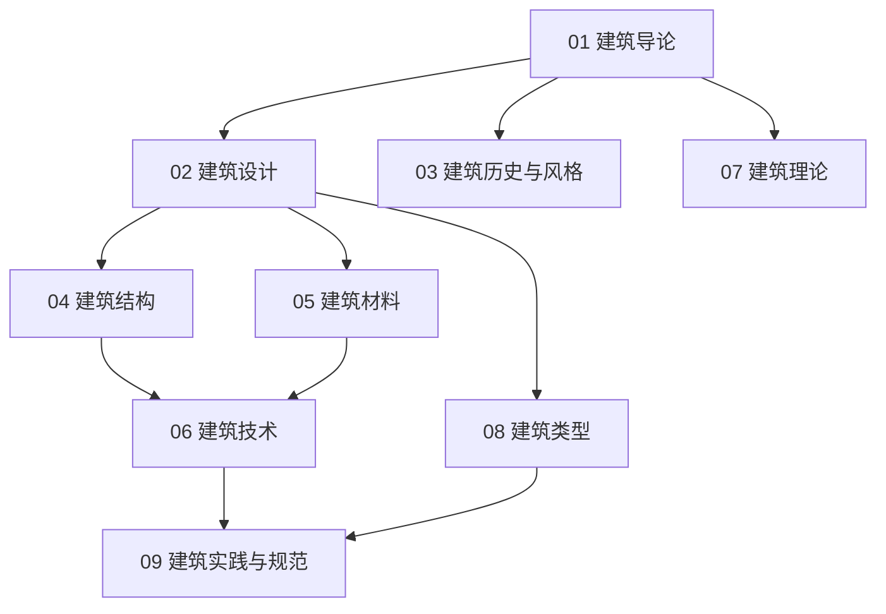

# 建筑知识地图

## 分层学习路线

| 层级 | 技能 | 对应章节 |
|:--:|------|:--:|
| L1 | 理解建筑定义、要素、历史 | 01 |
| L2 | 建筑设计、历史风格 | 02–03 |
| L3 | 结构、材料、技术 | 04–06 |
| L4 | 理论、类型、规范实战 | 07–09 |

## 三条主线

| 主线 | 内容 |
|------|------|
| **设计线** | 设计流程 → 平面/立面/剖面 |
| **技术线** | 结构 → 材料 → 构造 → BIM |
| **理论线** | 空间 → 形式 → 功能 → 文脉 |

## 关联

[[72-Architecture-建筑]] · [[3 Resources/7-Arts/raw/articles/72-Architecture-建筑/wiki/index|Wiki 索引]] · [[3 Resources/7-Arts/raw/articles/72-Architecture-建筑/99-资源收集/资源总览|资源总览]]
