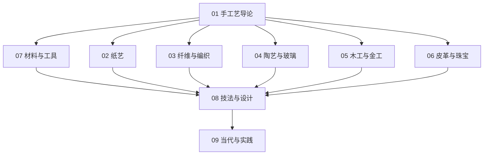

# 手工艺知识地图

## 分层学习路线

| 层级 | 技能 | 对应章节 |
|:--:|------|:--:|
| L1 | 理解手工艺定义、历史、分类 | 01 |
| L2 | 认识材料与工具 | 07 |
| L3 | 了解各大子类（纸/纤维/陶/木/皮） | 02–06 |
| L4 | 掌握基础技法与设计原则 | 08 |
| L5 | 当代实践与平台 | 09 |

## 三条主线

| 主线 | 内容 |
|------|------|
| **分类线** | 纸艺 → 纤维 → 陶艺 → 木工 → 皮革珠宝 |
| **基础线** | 材料 → 工具 → 技法 → 设计 |
| **实践线** | 学习 → 制作 → 平台 → 电商 |

## 关联

[[745.5-Handicrafts-手工艺]] · [[3 Resources/7-Arts/raw/articles/745.5-Handicrafts-手工艺/wiki/index|Wiki 索引]] · [[3 Resources/7-Arts/raw/articles/745.5-Handicrafts-手工艺/99-资源收集/资源总览|资源总览]]
