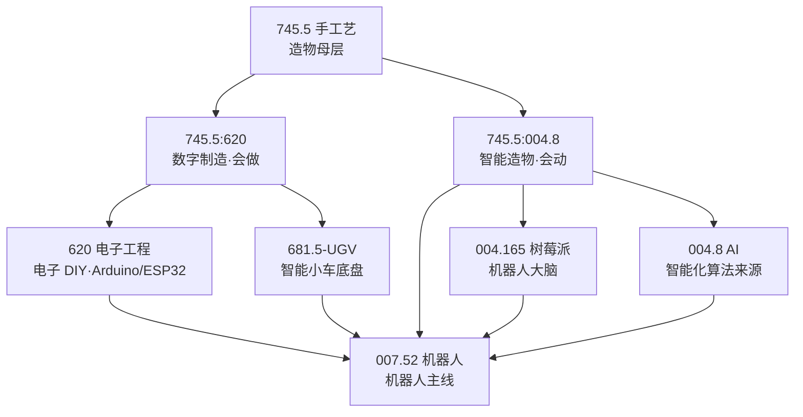

# 数字制造与智能造物

> **横切聚合页（Cross-Cutting MOC）**——串起被 UDC 分类法「切碎」的造物主题：从 3D 打印、电子 DIY，到会动的机器人。这是一个造物者不会觉得「跨学科」、但知识库确实散落五处的主线。

---

## 核心分界：会做 vs 会动

| | 数字制造（会做） | 智能造物（会动） |
|---|---|---|
| 问题 | 把设计变成实物 | 感知环境、自主决策、执行动作 |
| 代表 | 3D 打印 · 激光切割 · 桌面 CNC · 电子 DIY | 智能小车 · DIY 机械臂 · 树莓派机器人 |
| UDC | `745.5:620` | `745.5:004.8` |

> **一句话界定**：机器人是「会动的智能造物」；数字制造还包括「会做但不会自主移动」的造物。**机器人 ⊂ 智能造物 ⊂ 数字制造 ⊂ 手工艺**。

---

## UDC 谱系（maker 主线）

| UDC | 类目 | 在造物谱系中的位置 |
|-----|------|---------------------|
| `745.5` | 手工艺 / DIY | **母层**：业余手工、数字制造归属 |
| `745.5:620` | 手工艺 × 电子工程 | 数字制造（会做） |
| `745.5:004.8` | 手工艺 × AI | 智能造物（会动，本页主类号） |
| `620` | 工程学 / 电子工程 | 电子 DIY（Arduino/ESP32/电路） |
| `004.165` | 单板计算机 | 树莓派（上位机 / 机器人大脑） |
| `007.52` | 机器人 | 会动的造物分支（智能小车 / 机械臂） |
| `371.33` | 教育技术 | RoboMaster 教育机器人 |
| `004.8` | AI | 智能化算法来源（VLA / 机器视觉 / RL） |

> 工业线 `621`（机械工程）/ `670`（智能制造）/ `681.5`（自动化控制）在此仅作**背景对照**——那是对应工厂量产的视角，不是 maker 的造物场景。

---

## 知识库映射

| 已有库 | UDC | 造物定位 |
|--------|-----|-----------|
| [[3 Resources/7-Arts/raw/articles/745.5-Handicrafts-手工艺/745.5-Handicrafts-手工艺\|745.5 手工艺]] | 745.5 | 手作母层 + 数字制造（3D 打印/激光/CNC） |
| [[3 Resources/6-Technology/raw/articles/681.5-UGV/681.5-UGV\|681.5 UGV]] | 745.5 | 履带/轮式移动底盘（智能小车） |
| [[3 Resources/000-Knowledge/raw/articles/004.165-RaspberryPi-简体版/004-树莓派\|004.165 树莓派]] | 004.165 | 上位机 / 机器人大脑 |
| [[3 Resources/6-Technology/raw/articles/681.5-RoboMaster/681.5-RoboMaster\|681.5 RoboMaster]] | 371.33 | 教育机器人 + SDK + 赛事 |
| [[3 Resources/6-Technology/raw/articles/620-Engineering-工程学/620-Engineering-工程学\|620 工程学（电子 DIY）]] | 620 | 电子 DIY（research-電子diy / esp32 / 工具与工坊） |
| [[3 Resources/6-Technology/raw/articles/621.38-Electronics-电子/621.38-Electronics-电子\|621.38 电子]] | 621.38 | 电子理论（欧姆定律 / MCU / PCB / Arduino/ESP32 实体） |
| [[3 Resources/000-Knowledge/raw/articles/007.52-Robotics-机器人/007.52-Robotics-机器人\|007.52 机器人]] | 007.52 | 机器人主线（含智能小车 MOC） |

---

## 学习路径（从造物到造智能物）

| 层级 | 阶段 | 对应知识库 |
|:--:|------|-----------|
| L1 | 传统手作（会做手工） | 745.5 手工艺 |
| L2 | 数字制造（会做实物） | 745.5 手工艺 · 数字制造 |
| L3 | 电子 DIY（会编程控制） | 620 电子工程 · 621.38 电子 |
| L4 | 智能小车（会动） | 681.5-UGV · 681.5 RoboMaster |
| L5 | 机器人（会感知决策） | 007.52 机器人 · 004.165 树莓派 |
| L6 | AI 造物（会学习） | 004.8 AI · [[3 Resources/6-Technology/raw/articles/620-Engineering-工程学/04-电子工程/research-AI造物-2026-09-10\|AI 造物简报]] |

---

## 关联

- [[0 Inbox/1-input/fleeting/业余手工|业余手工（数字制造框架）]]
- [[0 Inbox/1-input/fleeting/電子DIY|電子DIY（深化研讨）]]
- [[3 Resources/6-Technology/raw/articles/620-Engineering-工程学/04-电子工程/research-電子diy-2026-09-04|電子DIY 研究简报]]
- [[3 Resources/6-Technology/raw/articles/620-Engineering-工程学/04-电子工程/research-AI造物-2026-09-10|AI 造物研究简报（L6）]]
- [[3 Resources/6-Technology/raw/articles/620-Engineering-工程学/04-电子工程/research-M5Stack-2026-09-06|M5Stack 研究（边缘 AI 硬件）]]
- [[3 Resources/6-Technology/raw/articles/620-Engineering-工程学/04-电子工程/research-esp32-2026-09-04|ESP32 研究]]
- [[3 Resources/6-Technology/raw/articles/620-Engineering-工程学/04-电子工程/research-工具与工坊-2026-09-04|工具与工坊研究]]
- [[3 Resources/000-Knowledge/raw/articles/004.165-RaspberryPi-简体版/00-MOCs/树莓派知识地图|树莓派知识地图]]
- [[3 Resources/6-Technology/raw/articles/681.5-UGV/00-MOCs/UGV知识地图|UGV 知识地图]]
- [[3 Resources/6-Technology/raw/articles/621.38-Electronics-电子/00-MOCs/电子知识地图|电子知识地图]]
- [[3 Resources/000-Knowledge/raw/articles/007.52-Robotics-机器人/00-MOCs/智能小车-MOC|智能小车 MOC]]

---

## 待办

- [ ] 将 `业余手工.md` 从 Inbox triage 至本知识库，作为「数字制造」概念的正式落点
- [ ] 确认 `電子DIY.md` 深化研讨笔记的最终路由（620 电子工程 vs 本横切 MOC）
- [x] 补充「AI 造物」层（004.8 × maker：VLA / TinyML / 机器视觉）→ 见 [[3 Resources/6-Technology/raw/articles/620-Engineering-工程学/04-电子工程/research-AI造物-2026-09-10|research-AI造物]]
