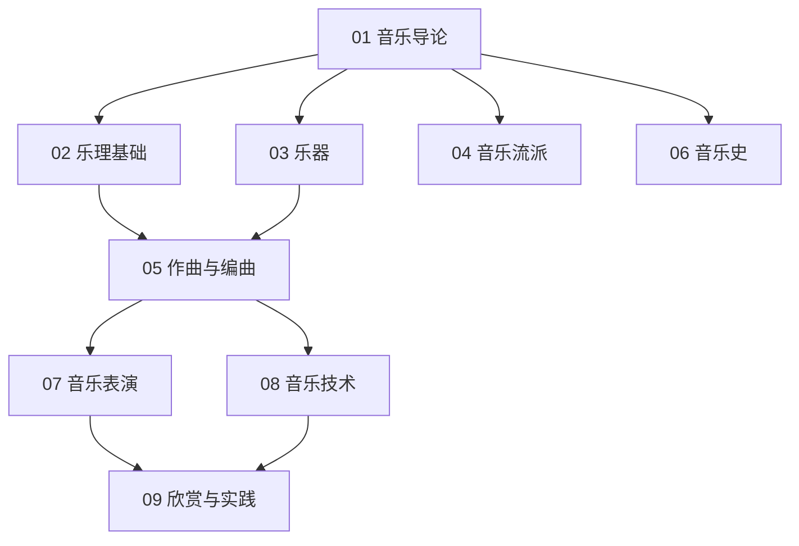

# 音乐知识地图

## 分层学习路线

| 层级 | 技能 | 对应章节 |
|:--:|------|:--:|
| L1 | 理解音乐定义、要素、历史 | 01 |
| L2 | 乐理基础、乐器 | 02–03 |
| L3 | 流派、作曲编曲、音乐史 | 04–06 |
| L4 | 表演、技术、欣赏实践 | 07–09 |

## 三条主线

| 主线 | 内容 |
|------|------|
| **理论线** | 音高 → 音阶 → 和声 → 记谱 |
| **实践线** | 乐器 → 表演 → 作曲 → 编曲 |
| **技术线** | MIDI → DAW → 录音 → AI 音乐 |

## 关联

[[78-Music-音乐]] · [[3 Resources/7-Arts/raw/articles/78-Music-音乐/wiki/index|Wiki 索引]] · [[3 Resources/7-Arts/raw/articles/78-Music-音乐/99-资源收集/资源总览|资源总览]]
