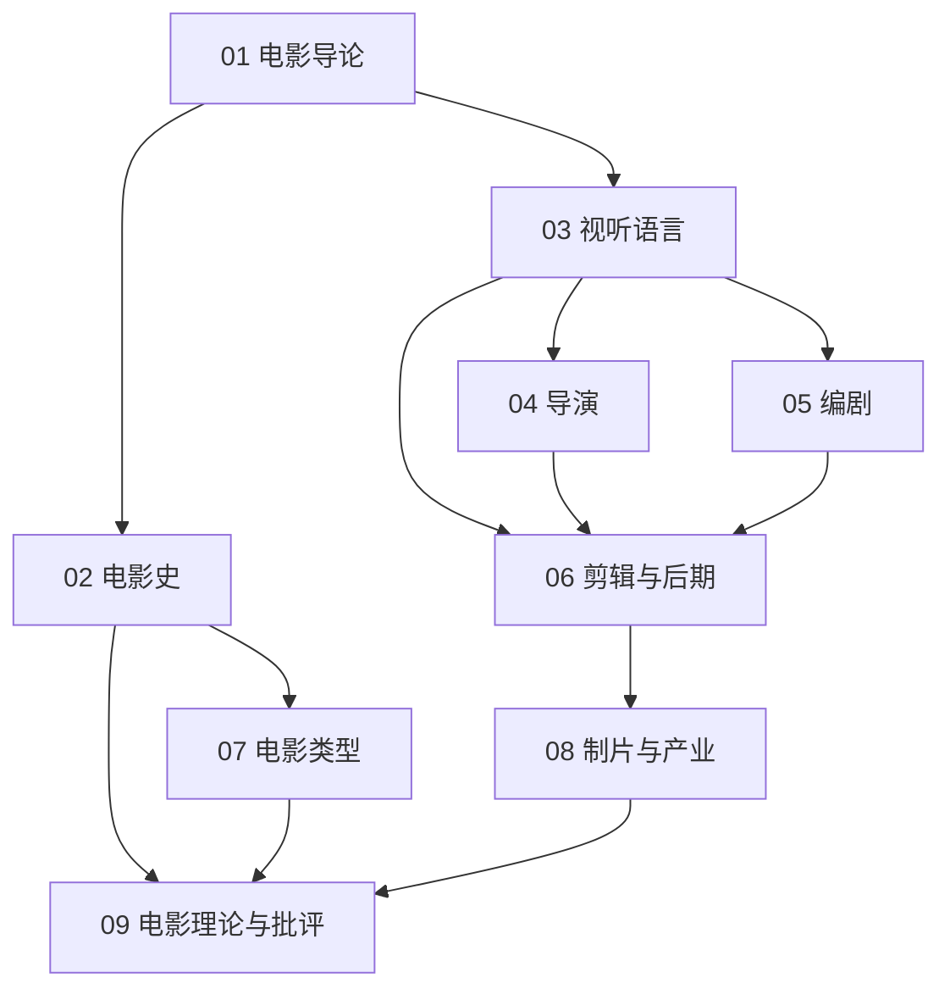

# 电影知识地图

## 分层学习路线

| 层级 | 能力 | 对应章节 |
|:--:|------|:--:|
| L1 | 理解电影的本质、诞生与历史脉络 | 01–02 |
| L2 | 掌握视听语言（画面/声音/剪辑） | 03 |
| L3 | 理解导演与编剧的创作方法 | 04–05 |
| L4 | 掌握剪辑后期与类型系统 | 06–07 |
| L5 | 了解产业生态与理论批评 | 08–09 |

## 三条主线

| 主线 | 内容 |
|------|------|
| **观影线** | 视听语言 → 类型 → 理论批评 |
| **创作线** | 编剧 → 导演 → 剪辑后期 |
| **产业线** | 电影史 → 制片产业 → 电影节与奖项 |

## 关联

[[791-Film-电影]] · [[3 Resources/7-Arts/raw/articles/791-Film-电影/wiki/index|Wiki 索引]] · [[3 Resources/7-Arts/raw/articles/791-Film-电影/99-资源收集/资源总览|资源总览]]
