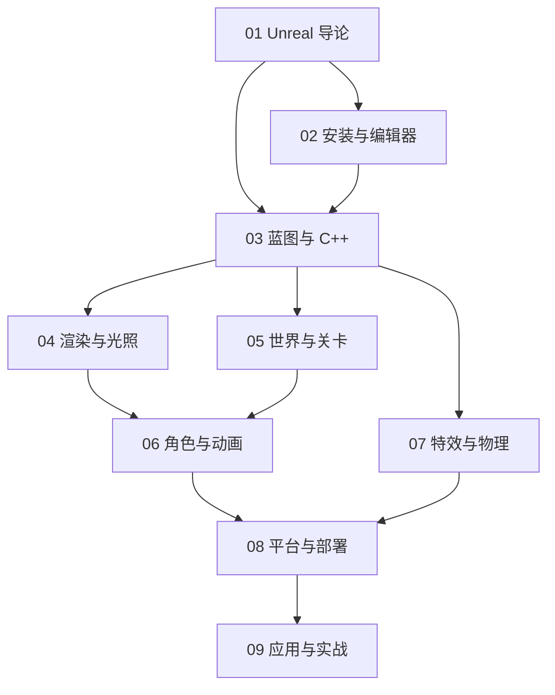

# Unreal Engine 知识地图

## 分层学习路线

| 层级 | 技能 | 对应章节 |
|:--:|------|:--:|
| L1 | 理解 Unreal Engine 定位与核心理念 | 01 |
| L2 | 安装、编辑器、创建项目 | 02 |
| L3 | 掌握蓝图与 C++、渲染光照 | 03–04 |
| L4 | 世界关卡、角色动画 | 05–06 |
| L5 | 特效物理、平台部署、应用实战 | 07–09 |

## 三条主线

| 主线 | 内容 |
|------|------|
| **开发线** | 蓝图 → C++ → 项目 |
| **画面线** | Nanite → Lumen → MegaLights → 材质 |
| **内容线** | 关卡 → 角色 → 特效 → 部署 |

## 关联

[[794.8-Unreal-Engine]] · [[3 Resources/7-Arts/raw/articles/794.8-Unreal-Engine/wiki/index|Wiki 索引]] · [[3 Resources/7-Arts/raw/articles/794.8-Unreal-Engine/99-资源收集/资源总览|资源总览]]
