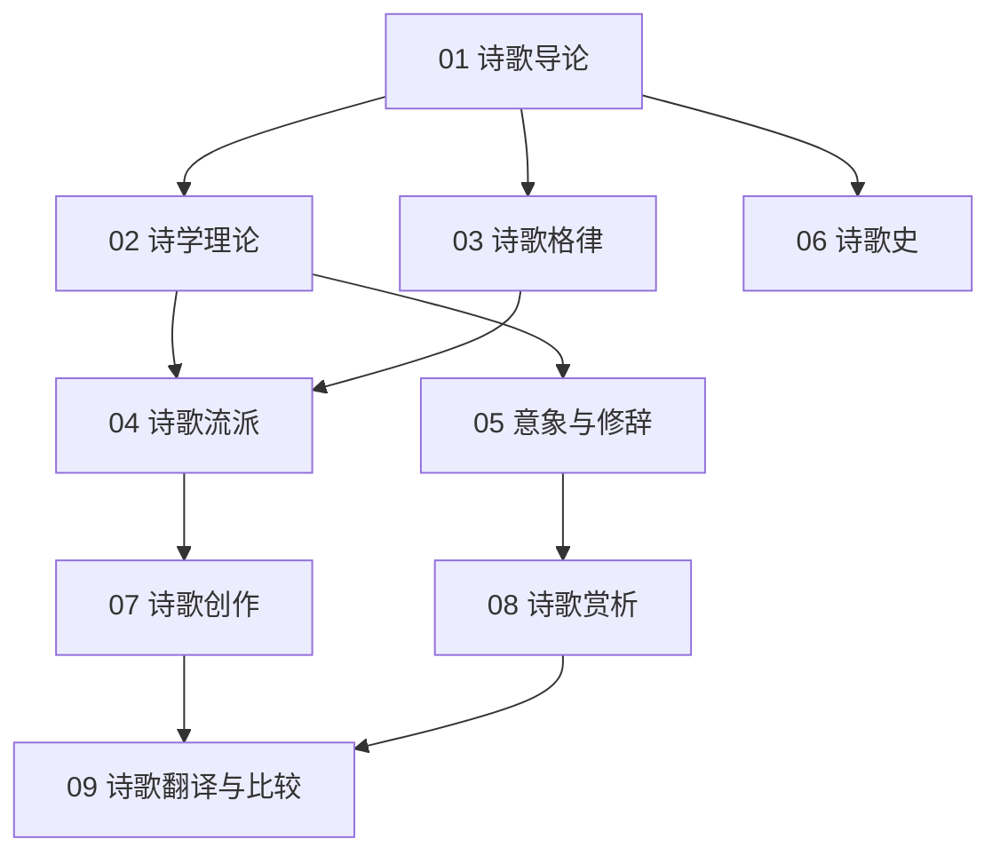

# 诗歌知识地图

## 分层学习路线

| 层级 | 技能 | 对应章节 |
|:--:|------|:--:|
| L1 | 理解诗歌定义、要素、分类 | 01 |
| L2 | 诗学理论、格律 | 02–03 |
| L3 | 流派、意象修辞、诗歌史 | 04–06 |
| L4 | 创作、赏析、翻译比较 | 07–09 |

## 三条主线

| 主线 | 内容 |
|------|------|
| **理论线** | 诗言志 → 意境 → 韵律 → 格律 |
| **实践线** | 意象 → 修辞 → 创作 → 赏析 |
| **比较线** | 中国诗史 → 西方诗史 → 翻译比较 |

## 关联

[[82-1-诗歌]] · [[3 Resources/8-Literature/raw/articles/82-1-诗歌/wiki/index|Wiki 索引]] · [[3 Resources/8-Literature/raw/articles/82-1-诗歌/99-资源收集/资源总览|资源总览]]
