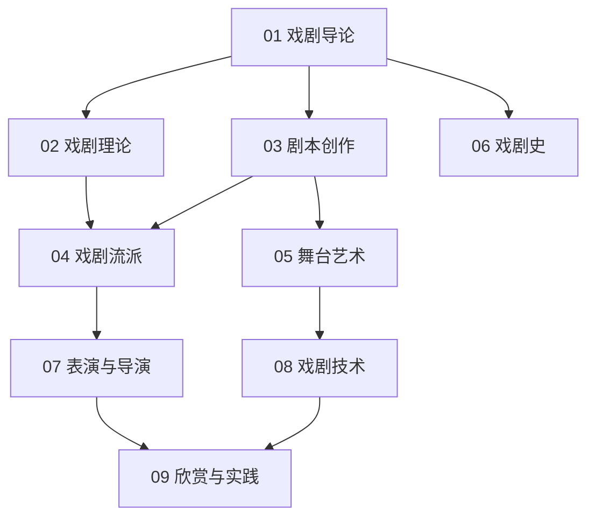

# 戏剧知识地图

## 分层学习路线

| 层级 | 技能 | 对应章节 |
|:--:|------|:--:|
| L1 | 理解戏剧定义、要素、本质 | 01 |
| L2 | 戏剧理论、剧本创作 | 02–03 |
| L3 | 流派、舞台艺术、戏剧史 | 04–06 |
| L4 | 表演导演、技术、欣赏实践 | 07–09 |

## 三条主线

| 主线 | 内容 |
|------|------|
| **理论线** | 冲突 → 悲剧/喜剧 → 三一律 → 三幕结构 |
| **实践线** | 剧本 → 舞台 → 表演 → 导演 |
| **技术线** | 舞台机械 → 灯光音响 → 沉浸式/数字剧场 |

## 关联

[[82-2-戏剧]] · [[3 Resources/8-Literature/raw/articles/82-2-戏剧/wiki/index|Wiki 索引]] · [[3 Resources/8-Literature/raw/articles/82-2-戏剧/99-资源收集/资源总览|资源总览]]
